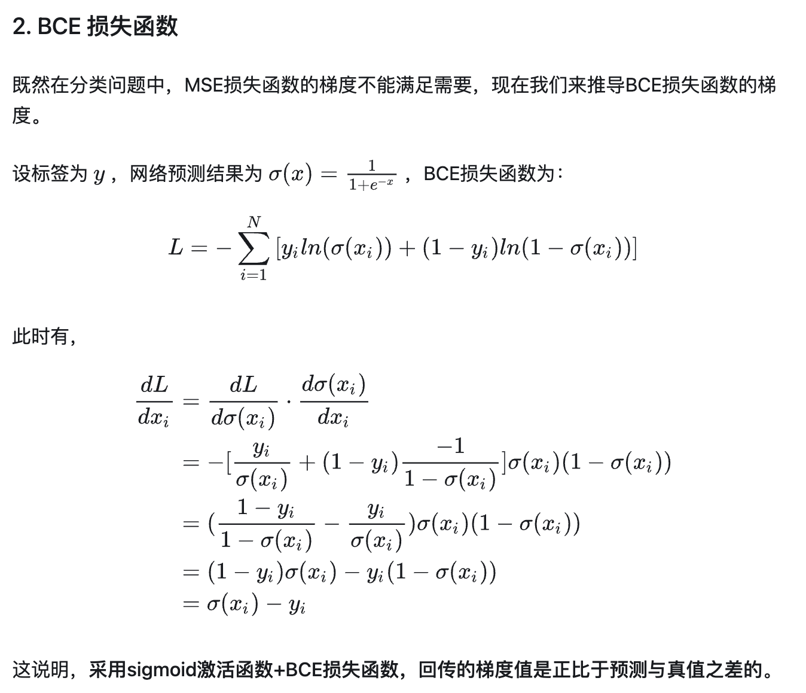
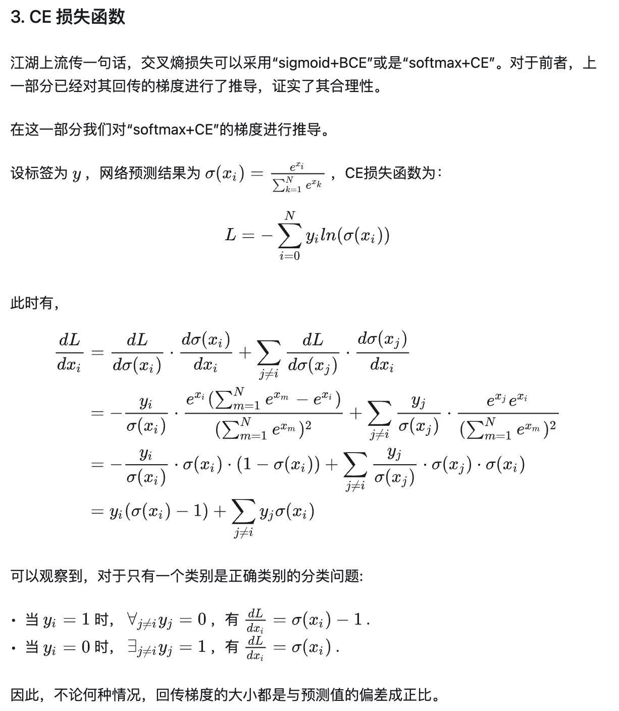
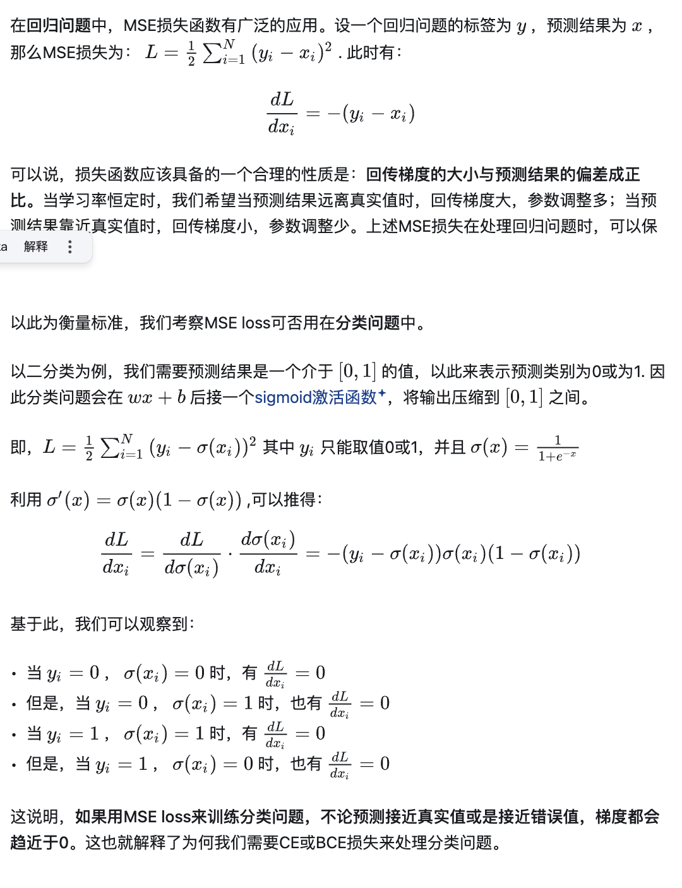

## 召回粗排的损失函数loss function
## BCE损失函数&&CE损失函数
一般搭配BCE+sigmoid，CE+softmax

https://zhuanlan.zhihu.com/p/421830591
### 常见问题
#### 为何MSE loss是一种回归问题的loss，不可以用在分类问题？而非要用CE或BCE呢？

### reference
https://zhuanlan.zhihu.com/p/557416100