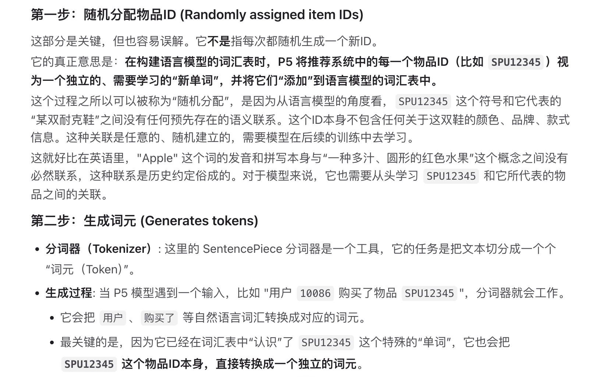
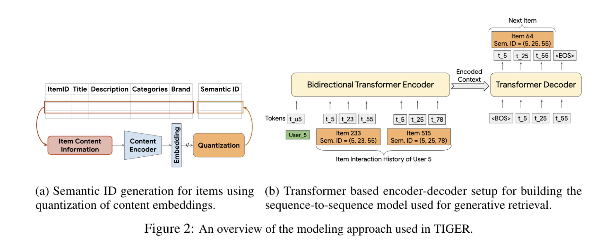

## Recommender Systems with Generative Retrieval（Tiger）
### 综诉
P5模型

### Model 
#### 核心创新点 
将语义 ID 融入序列到序列模型可提升模型泛化能力，这一点在无历史交互物品的召回性能提升上得到验证
#### 核心能力
给定物品的文本特征，我们使用预训练文本编码器（如 SentenceT5 [27]/BERT [7]）生成稠密的内容嵌入，再对物品嵌入进行量化处理，得到一组有序的标记 / 码字，即该物品的语义 ID。最终，我们使用这些语义 ID 训练 Transformer 模型，以完成序列推荐任务

## Beyond Unimodal Boundaries: Generative Recommendation with Multimodal Semantics
### Model 核心创新点
1. 早期融合
Finding1: AMI+不同模态间预测结果的重叠比例：多模态表示中文本信息占据主导地位，而其他模态的贡献则被削弱（Table1 和 Table2，定义Appendix A.1）
好处：单一模态编码器能在编码阶段捕捉模态间的交互关系
2. 晚期融合(提出)
定义模态集合，为每一个模态单独生成语义ID
问题：如表 3 所示，相比于只预测序列的一个子集（仅文本或仅图像），在预测完整的多模态语义 ID 序列时，模型性能出现显著下降
Finding2: 可能可以在某一模态预测正确（比如文本），但是图像预测错误，没有办法通过正确的文本预测映射到正确的图像预测
Finding3: 原因：多模态会给语义 ID 的条件生成带来挑战。序列推荐模型通常以自回归方式生成语义 ID，后一个 ID 基于前面已生成的 ID 进行预测。这种方式在单模态数据上效果良好，因为每个新 ID 都可作为前序 ID 的残差信息。但在多模态场景下会出现问题，原因是一个模态的语义信息通常并不依赖于其他模态的语义信息
3. 增强型晚期融合框架 MGR-LF++
Solution2: 序列推荐模型进行微调，明确让模型学习匹配不同模态间的对应 ID，当模型学会文本与视觉 ID 的匹配关系后，再在序列推荐任务上进行二次微调
Solution3: 显式标记模态切换。在语义ID序列中引入**特殊标记** \(S=s_{1}, s_{2}, ..., s_{k-1}\)。每个 \(s_{i}\) 用于表示从第 \(i-1\) 个模态到第 \(i\) 个模态的**模态切换**。由此得到修正后的语义ID序列：
\[C=\left[c_{0}, ..., c_{i}, s_{1}, c_{i+1}, ..., s_{k-1}, ..., c_{n}\right]\]
### Experiment
#### Dataset
* Amazon review dataset：Toys、Beauty、Sports
* 仅保留交互历史不少于 5 次的用户与物品。将每个用户最后一次交互的物品作为测试样本，倒数第二次交互的物品作为验证样本，更早的交互物品作为训练样本。（8:1:1 train:test:val比例不清楚怎么构造的）
* 文本信息为商品标题与描述，视觉信息为商品高清原始图像，剔除无原始图像的物品。
#### Evaluation
NDCG：整体排序质量
MRR：首个相关物品的排名
Hit@5：相关物品在靠前推荐位置中的出现情况
#### Model
RQ-VAE 作为索引器、 T5 作为序列推荐模型
#### Baseline
1）各类序列推荐模型，包括经典方法如 SASREC（Kang & McAuley, 2018），以及基于语义 ID 的生成式推荐方法，如 LETTER（Jin et al., 2024）、HCindexer（Wang et al., 2024）和 TIGER (BERT)（Rajput et al., 2023）
2）以 TIGER 为主干网络，将所提方法与对应的单模态模型进行对比。这些基准模型记为 TIGER (CLIP-text) 和 TIGER (CLIP-image)，括号内为用于生成语义 ID 的特征编码器
本文的 MGR-EF、MGR-LF 和 MGR-LF++ 同样以 TIGER 为主干网络，分别采用 CLIP-text 与 CLIP-image 作为文本和图像特征编码器
#### Ablation
codebook size和semantic ID length

 

