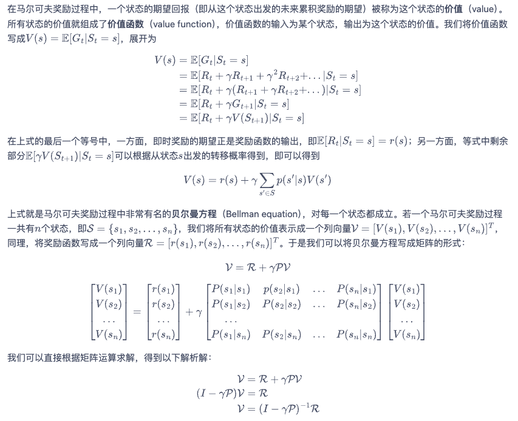
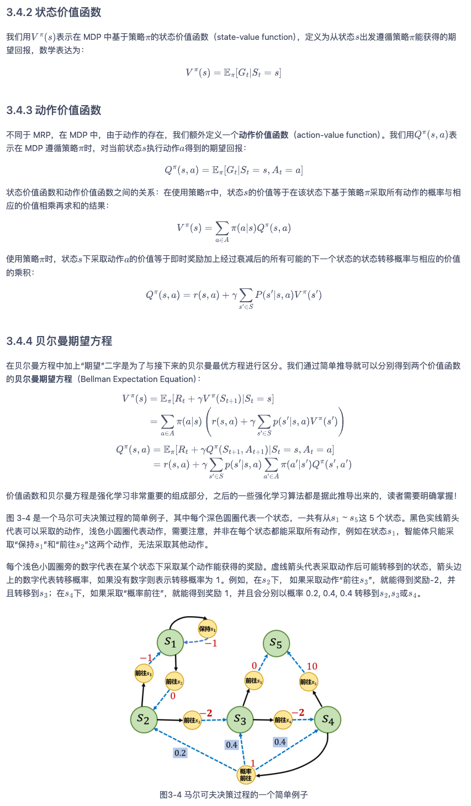
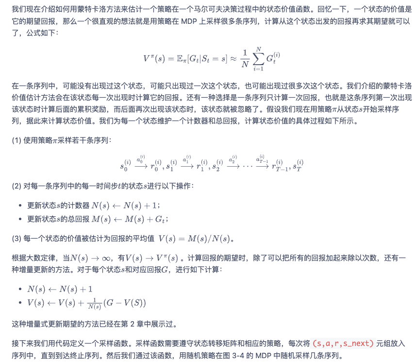
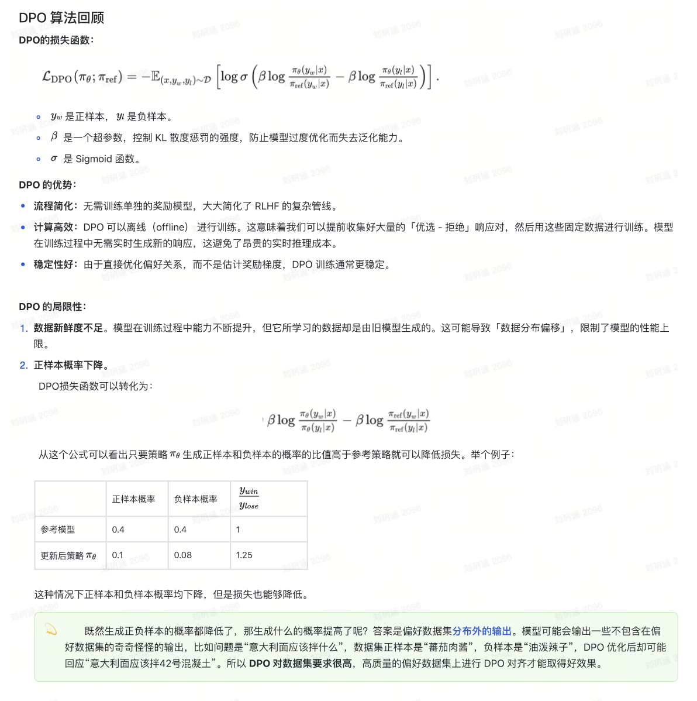

## 马尔可夫奖励过程MRP：贝尔曼方程
引入价值函数

## 马尔可夫决策过程MDP：MRP+Action
引入动作价值函数和贝尔曼期望方程

### 求解状态价值函数
MDP 的状态价值函数和MRP 的价值函数是一样的。于是我们可以用 MRP 中计算价值函数的解析解来计算这个 MDP 中该策略的状态价值函数。
#### 矩阵求解
#### MC 方法

## 最优策略求解
### 马尔可夫决策过程的状态转移概率不可知
#### dynamic programming
##### policy iteration=policy evaluation+policy improvement

##### value iteration

### model-free reinforcement learning
#### TD
##### Sarsa ：on policy
##### Q-learning ：off policy
* “显式建模价值”的路径：先估计出每个动作的价值（Q值），然后选择价值最高的动作。
### Actor-Critic
#### DPO（不属于Actor-Critic）
* “隐式优化策略”的路径：它不计算任何明确的奖励值或Q值，而是直接修改策略（模型本身），让策略倾向于生成偏好数据所指向的输出。

