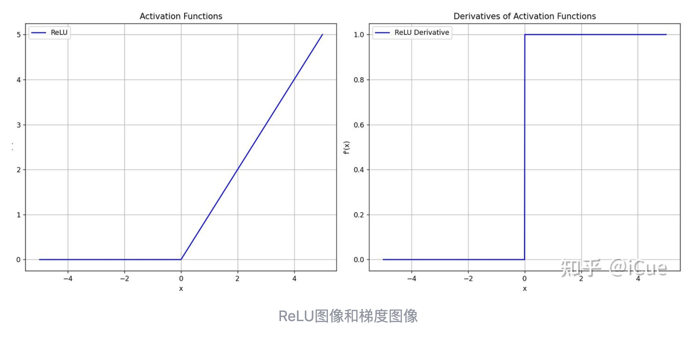
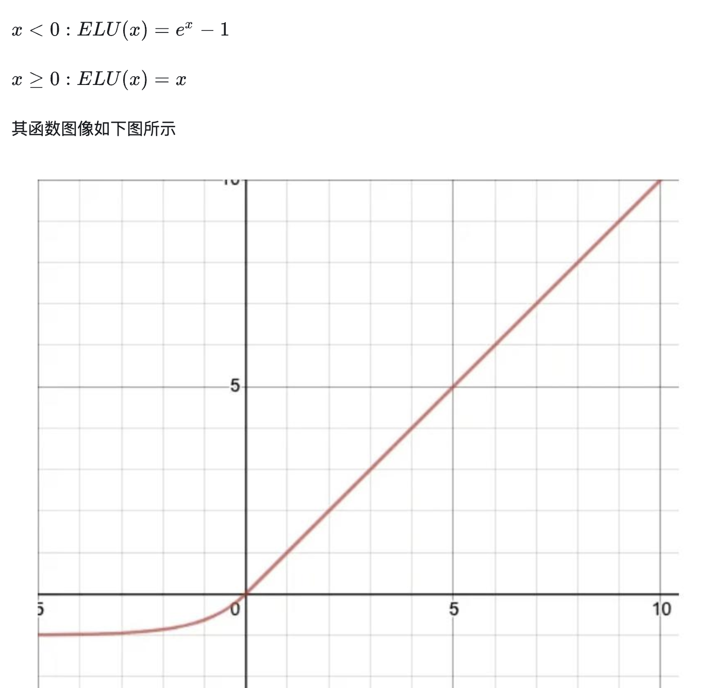
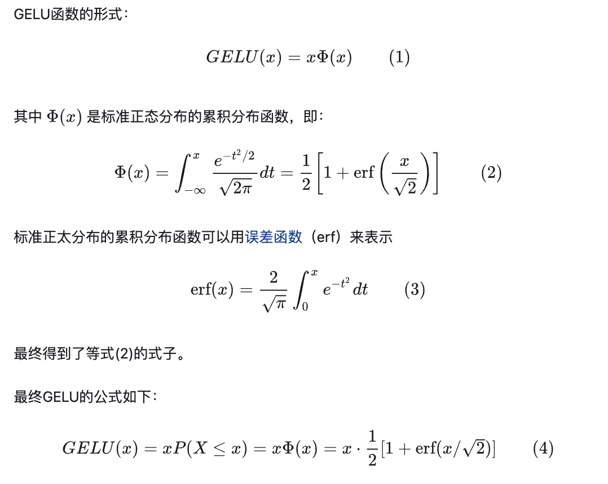
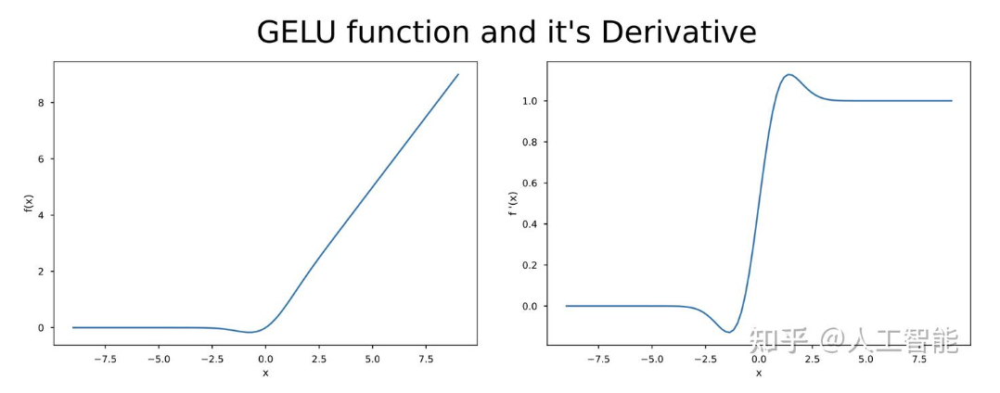

## RELU

相比sigmoid缓解梯度消失，=0的机制缓解过拟合，增强泛化能力
## ELU

## GELU（Gaussian Error Linear Unit）
类似于relu和sigmoid的结合

当 x 较大时，神经元以高概率被激活（输出接近 x）
当 x 较小时，神经元以低概率被激活（输出接近0）
​​随机正则化​​：GELU的非线性可以被视为一种“自适应Dropout”，其权重由输入自身决定，而非固定概率。
## SWISH
