# 分类方式一
## 非深度学习方法
### FPMC
1. 用户下一时刻将要交互的物品的得分=用户本身的特征预测+当前物品预测
1.1 用户本身的特征预测：
矩阵分解计算，等于用户向量和物品向量的点积
1.2 当前物品预测：
物品间的转移矩阵估计得到
2. 具体公式
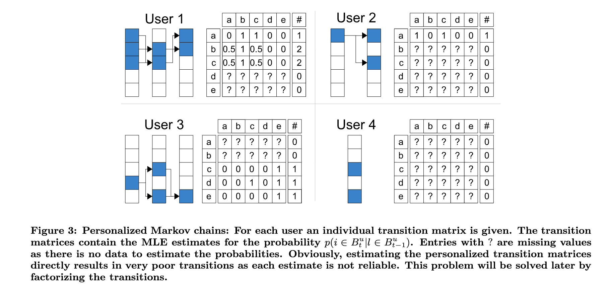
每一个用户都有一个概率转移的矩阵，堆叠起来成为transition cube，矩阵稀疏，所以采用成对交互建模
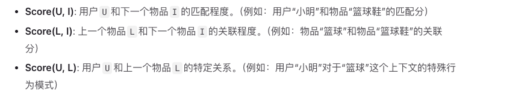
3. S-BPR损失训练
3.1 BPR损失
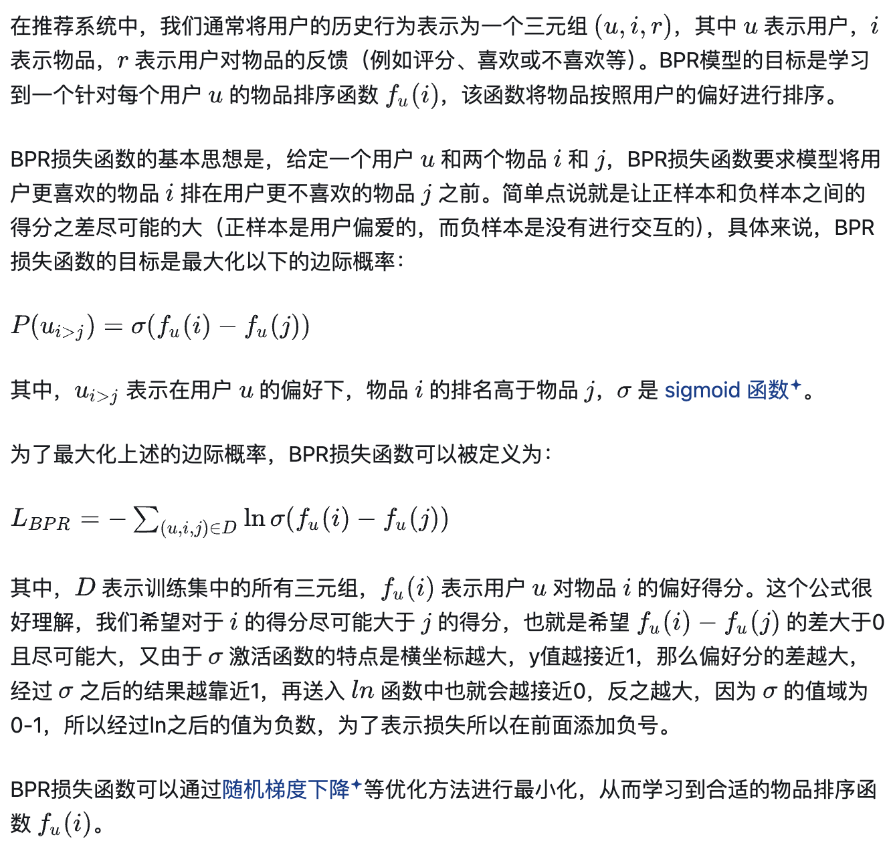
3.2 S-BPR损失(sequential)：S-BPR和BPR损失计算方法基本相同，只是额外考虑了当前时刻用户交互的物品。
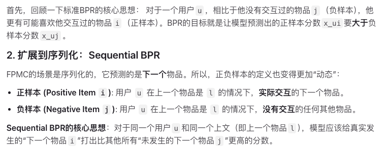

## Transformer诞生前的深度学习方法
### GRU4Rec
1. 模型结构
GRU是为了解决RNN梯度消失问题的一种改进模型
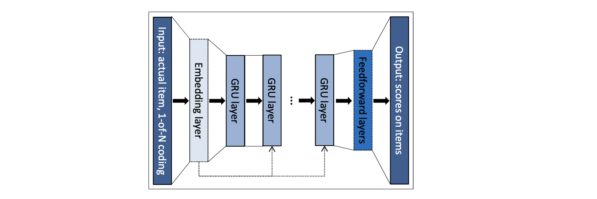
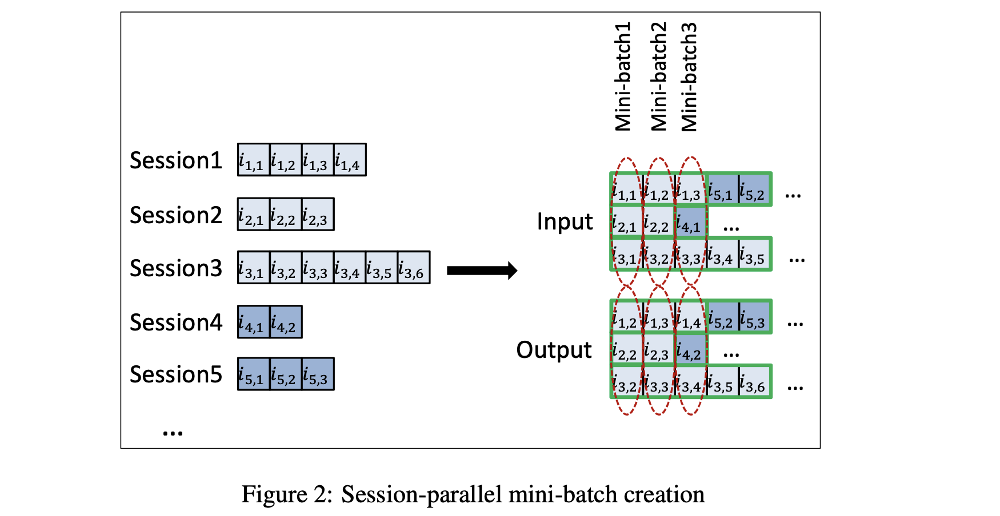
2. 损失函数
1.1 Top 1损失
定义正样本排名（负样本比正样本分数高+1），优化模型的目标就是让这个排名尽可能地接近0->指示函数不连续不可以用sigmoid代替->防止负样本分数和正样本一起比变大，导致模型数值溢出以及训练不稳定->使用sigmoid对负样本分数惩罚
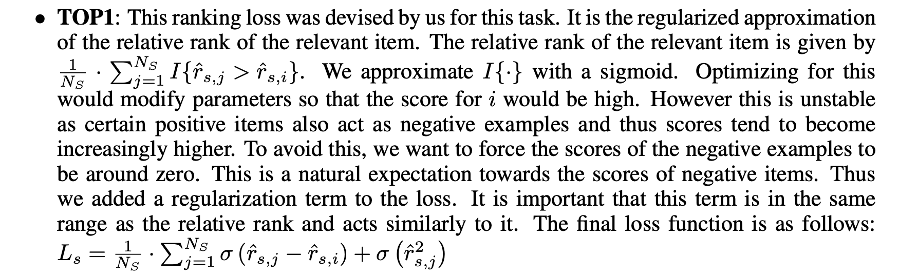
### GRU4Rec+
1. 负采样改进
负采样方面，在GRU4Rec中，作者使用同一个batch中其它用户行为序列对应的目标物品作为负样本。例如每个 batch 有N条用户行为序列，每条用户行为序列对应1个目标物品。这样，每条用户行为序列对应的1个目标物品作为正样本，其他N-1个物品作为负样本。这种采样方法等价于基于流行度采样。在GRU4Rec+中，除了使用当前batch中的其他用户行为序列的目标物品作为负样本以外，作者还同时使用从某个预定义分布中采样得到的物品作为负样本。这个预定义的分布可以是均匀分布或者流行度分布，或者两者的混合。
2. 损失函数创新
2.1 TOP1-max和BPR-max损失
打分最高的负样本权重应该最高，所以使用softmax概率作为负样本权重

3. weight-tying技术
共享模型输入层和输出层的embedding权重，效果都会提高
### Caser
既然RNN可以用来学习序列推荐任务。通过将时间作为一个维度，Embedding维度作为另一个维度，看作二维图片，能否用卷积神经网络（CNN）来进行建模呢？在Caser中，作者就使用CNN学习序列推荐任务。
在Caser中，模型使用用户近期交互过的L个物品预测接下可能的交互的T个物品。模型的输入为用户ID和用户交互过的物品ID序列。经过embedding层之后，用户的行为序列变为一个矩阵，一个维度为时间，维度的大小记为L ，一个维度为物品的 embedding维度，维度的大小记为d. 为了方便后续讨论，我们把这个矩阵称为 embedding序列。
模型使用两种卷积滤波器对embedding序列进行处理。一种卷积滤波器只会沿着时间维度滑动，卷积核的尺寸为h × d, h可以是任意小于等于L的数。另一种卷积滤波器只会沿着embedding维度滑动，卷积核的尺寸为L × 1，等价于对每个embedding维度不同时刻的特征进行加权求和。第一种滤波器的输出结果，还会在时间维度进行最大池化，每个滤波器最终得到一个d维向量。所有的滤波器的输出拼接在一起，经过一个全连接层后再和用户embedding拼接在一起，输入预测层，得到在不同物品上的分数。
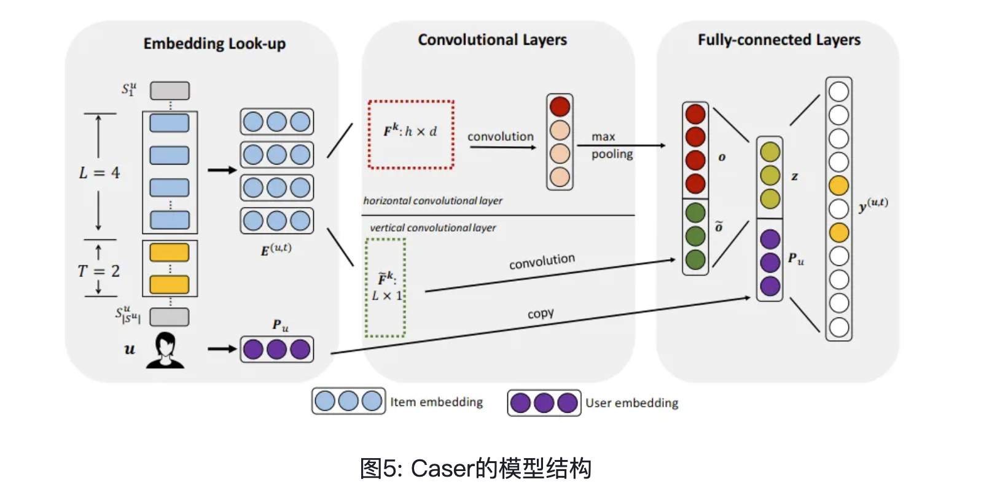
## 基于transformer的方法
### SASRec
单向注意力机制、BCE损失
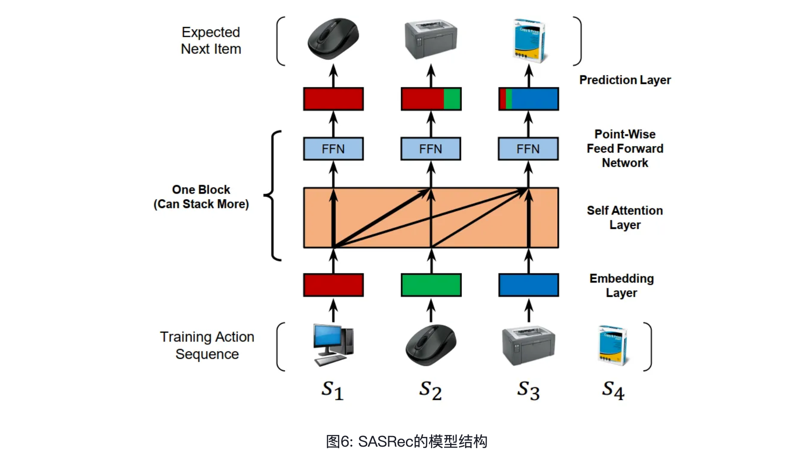
TiSASRec加入物品交互的时间间隔
### Bert4Rec
[mask]替换部分物品训练+[mask]拼接在序列末尾
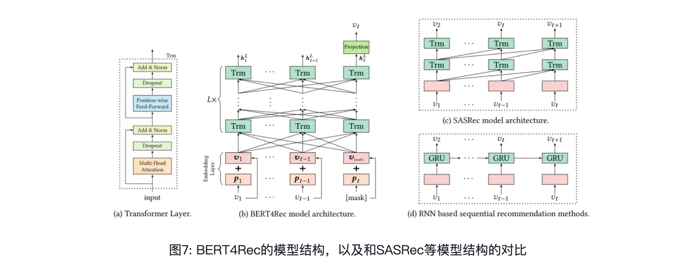

### FMLP-Rec
self-attention->filter layer
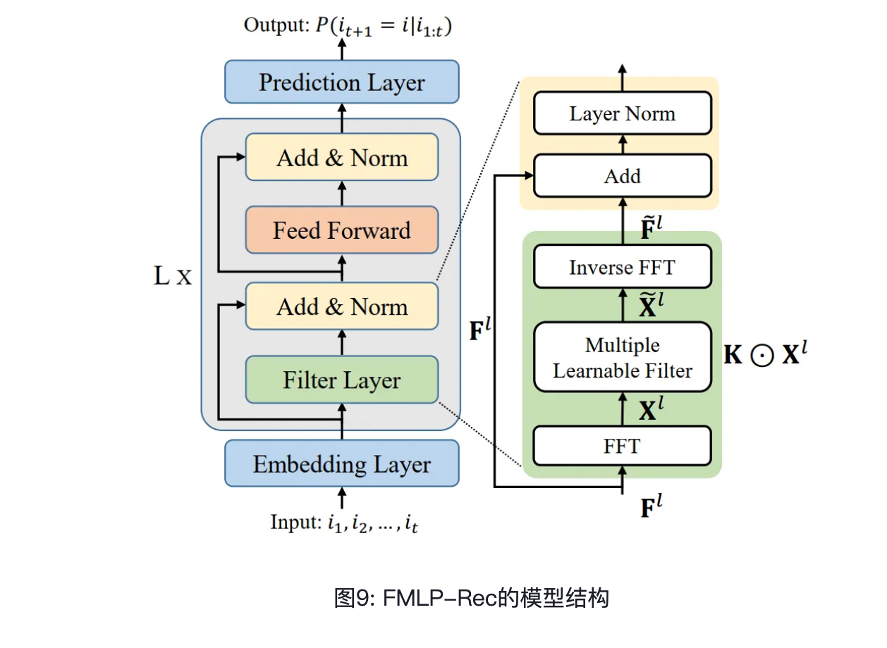

## 对比学习
### CLS4Rec
对比学习损失loss+推荐损失loss
物品裁剪（Item Crop），物品遮盖（Item Mask），物品打乱（Item Reorder）构造对比学习样本
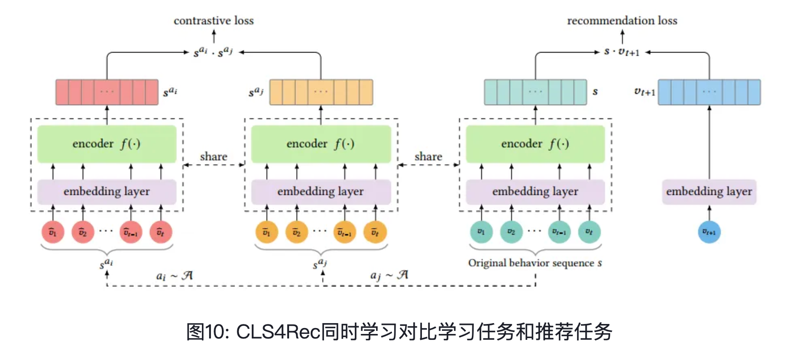

# 分类方式二
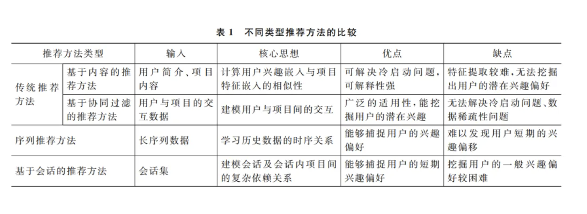
基于会话的推荐方法是将用户的全局交互行为 分割成一个个更小粒度的事务单元,每个事务单元 是由用户的部分交互行为组成的,这些事务单元被 称为会话[12-13]。会话可以在不同的场景中表现出 不同的含义,例如,在电子商务领域,会话可以是用 户一次购买的物品,或一小时内添加到购物车的商 品;在旅游场景,会话可以是用户一年内游玩的景 点;另外,会话也可以是用户一小时内浏览的网页、 一天内看的电影等。
## 基于会话推荐方法的分类 
### 传统
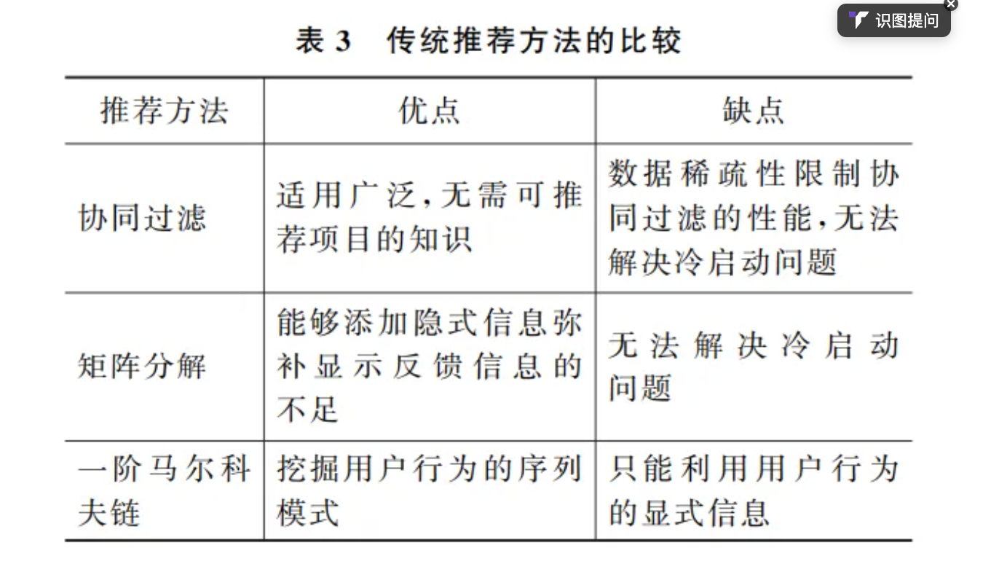
### 深度
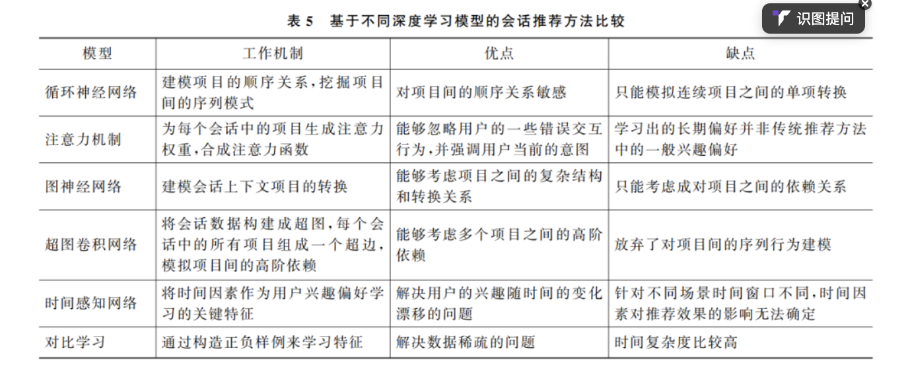
### 强化