## 召回（极端多分类）

### I2I召回
- 基本原理 ：离线计算好物品之间的相似度矩阵。常见的算法包括协同过滤（ItemCF）、Swing 算法，或者基于图神经网络（Graph Embedding）和内容特征的相似度计算。
- 线上服务 ：速度极快。线上只需要拿到用户近期交互过的物品列表，去 KV 数据库（如 Redis）中直接查表，取出对应的相似物品即可（O(1) 复杂度）。
- 用户体验 ：相关性极强且可解释性好。用户能明确感知到“因为我刚才看了A，所以系统给我推荐了相似的B”。
- 局限性 ：容易导致“信息茧房”，推荐结果的泛化性和发散性较弱；纯基于行为的 I2I（如 ItemCF）很难处理零交互的冷启动物品。
- 适合作为 实时意图召回 。例如在电商场景中，当用户点击了一件衣服后，I2I 能够极其迅速且精准地在下拉流中推荐款式相近的衣服，承接用户的即时转化需求。

**EGES（Enhanced Graph Embedding with Side Information）**
* 会话构建商品图，EGES采用带权随机游走策略生成训练序列。从一个节点出发，转移概率由边权重决定
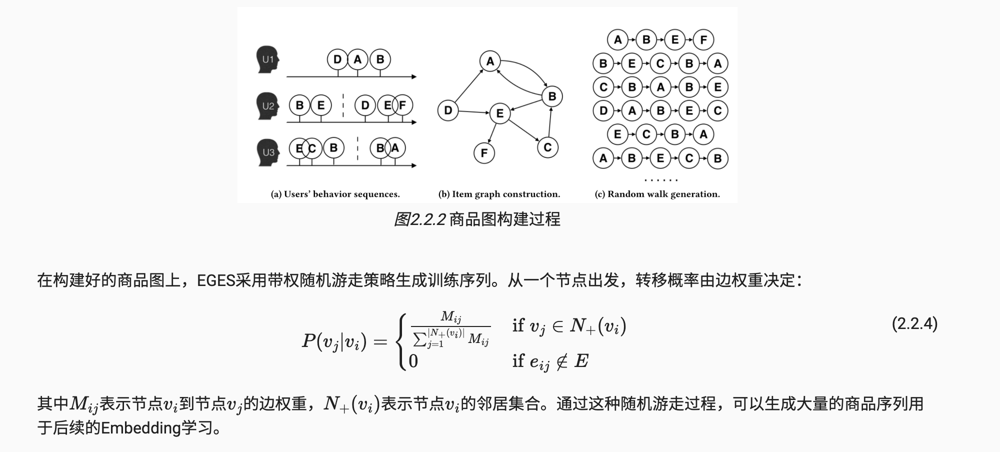
* 引入商品的辅助信息（如类别、品牌、价格区间等）来增强商品的向量表示
* EGES的核心创新在于认识到不同类型的辅助信息应该有不同的重要性，所以不是平均聚合embedding
* 冷启动商品的处理：
- 对于新上架且没有任何用户交互历史的商品，EGES提供了有效的冷启动解决方案。由于这类商品缺乏行为数据，无法通过随机游走生成训练序列，因此既不存在基于ID的向量表示，也没有经过训练的注意力权重参数
- 在这种情况下，系统采用简单而有效的mean pooling策略：直接对该商品的所有辅助信息向量（类别、品牌、价格区间等）进行平均聚合来构建商品表示。虽然这种方法无法体现不同属性的差异化重要性，但能够有效利用商品的内容特征，从而支持基于向量相似度的商品召回（I2I召回）。

**Airbnb**
* 调整skipgram损失函数，引入对最终预测的约束
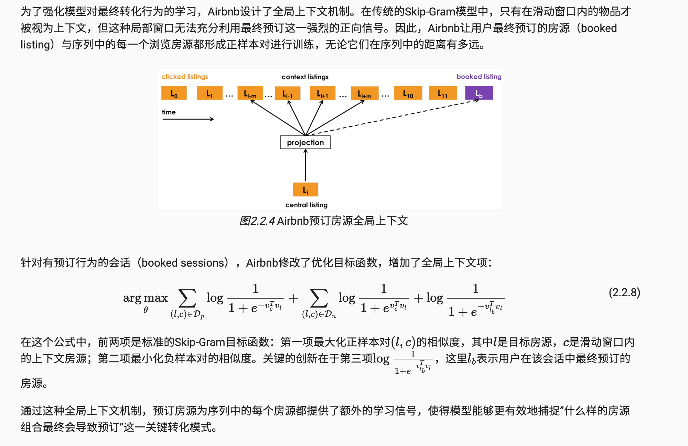
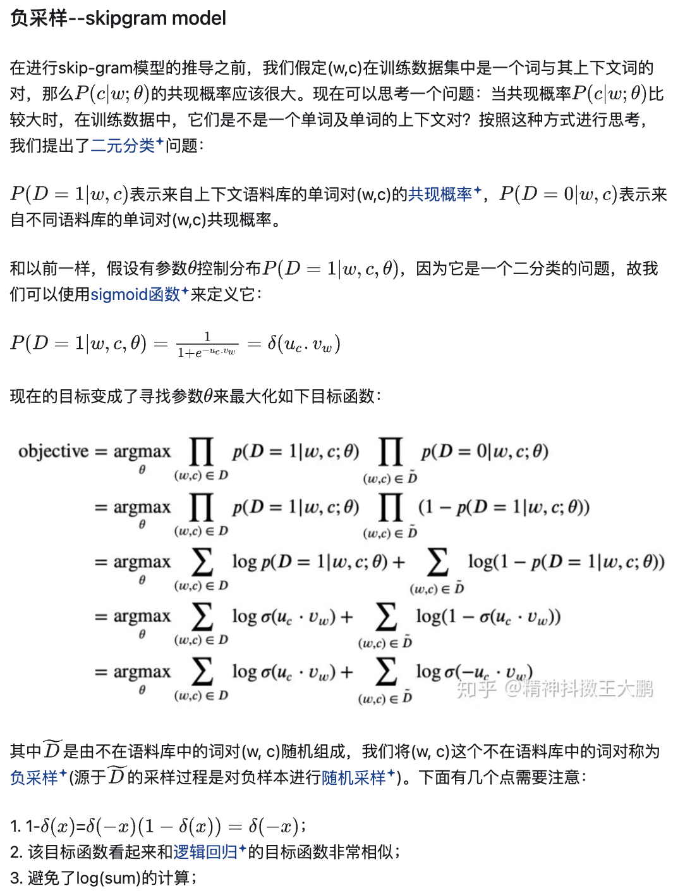

### 双塔 U2I（User-to-Item）
* 因子分解机FM->公式重构为User vector和Item vector的乘积
* 冷启动和用户个性化程度较好
* UserCF属于 U2U2I（广义上归为 U2I）：系统先找到相似的人（U2U），再把那些人喜欢的物品推荐给当前用户（U2I）
* 负采样技术是因为将召回任务视为一个极端多分类问题，将物料库中的所有物品看作不同的类别。模型的目标是最大化用户对正样本物品的预测概率。
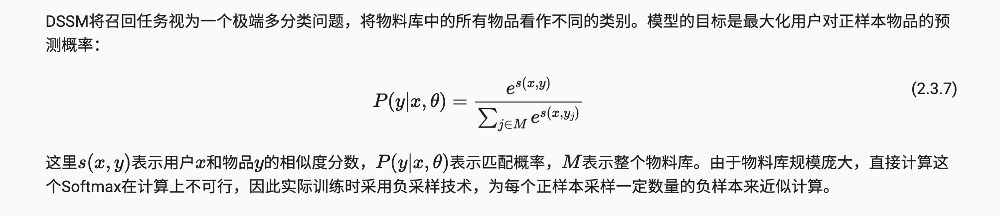

#### YoutubeDnn
核心思想是将用户和物品映射到同一个向量空间。它花费了主要的网络结构来精心构建“用户向量”，而“物品向量”则更像是一个巨大的查找表。
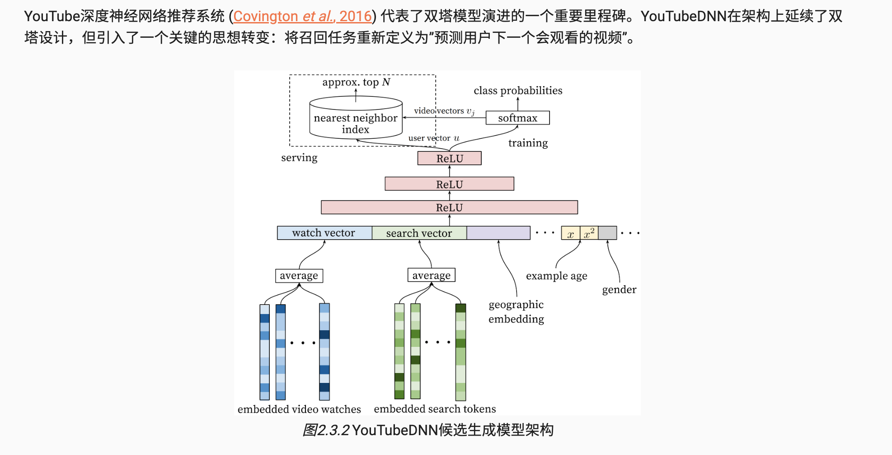
#### Din（应该在后面排序）
传统deep模型会把用户历史行为embedding平均，但是Din通过 Activation Unit (AU) 对用户浏览历史进行加权，从而实现对 sequence feature 数据的学习利用。
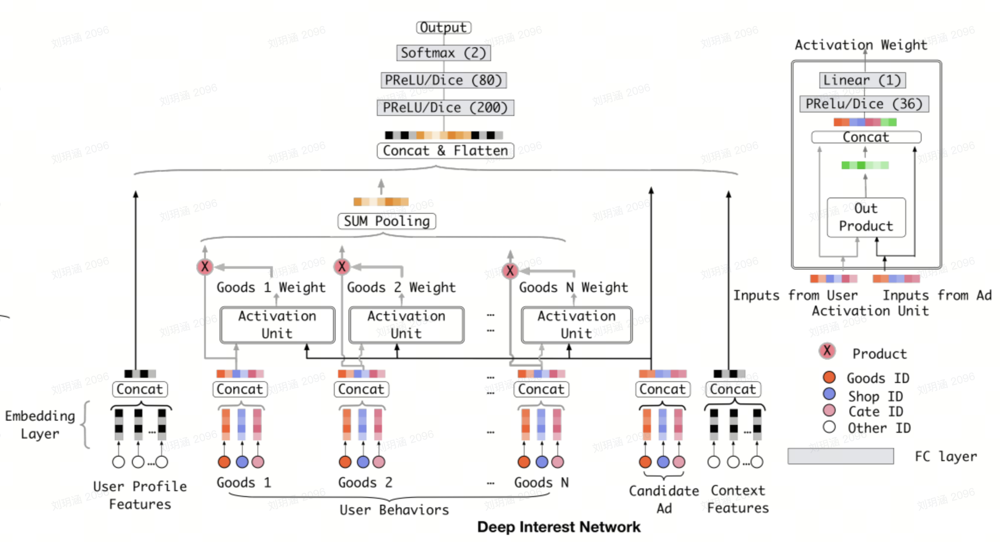

## 排序（精确打分）
排序模型与召回模型的样本格式不同。排序模型是一个点击率预测模型，输入是用户-物品对，输出是该用户点击该物品的概率。因此，我们需要构建正负样本。
### Wide & Deep 模型（google）
* 平衡记忆与泛化
* Wide部分的关键在于其输入的特征向量。它不仅包含原始特征，更重要的是包含了大量人工设计的交叉特征（Cross-product Features）。交叉特征可以将多个独立的特征组合成一个新的特征，用于捕捉特定的共现模式。例如，在应用商店的推荐场景中，我们可以创建一个交叉特征AND(installed_app=photo_editor, impression_app=filter_pack)，它代表用户已经安装了“照片编辑器”应用，并且现在看到了“滤镜包”应用的推荐。
* Deep部分是一个标准的前馈神经网络（DNN），它负责模型的“泛化能力”。与Wide部分依赖人工特征工程不同，Deep部分可以自动学习特征之间的高阶、非线性关系。
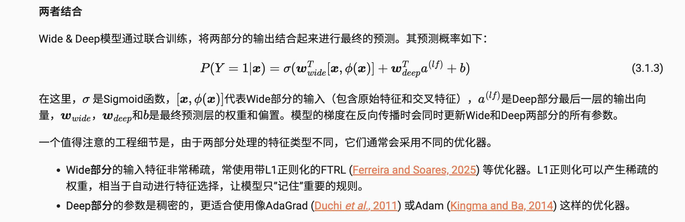
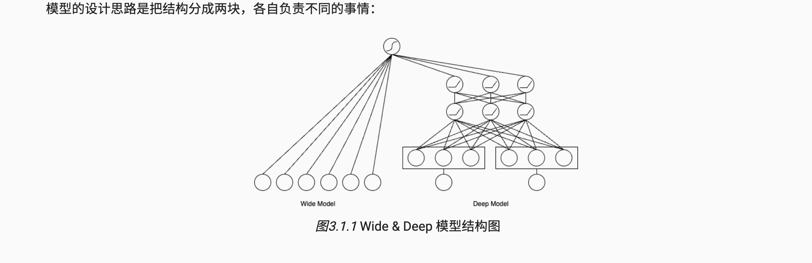

### 特征交叉由人工选择到自动
既能自动学习特征交叉，又不会让参数太多，FM精髓特征共享
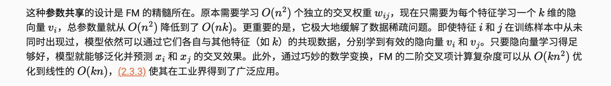
#### DeepFM（二阶特征交叉）
DeepFM 的核心思路很简单：用 FM 处理低阶特征交互，用深度网络处理高阶特征交互，两者共享同一套 Embedding。这样做的好处是减少了人工特征工程的工作量，模型可以自动学习各种特征交互模式。相比 Wide & Deep 需要专家手工构造 Wide 部分的特征，DeepFM 用 FM 替代了这部分工作。
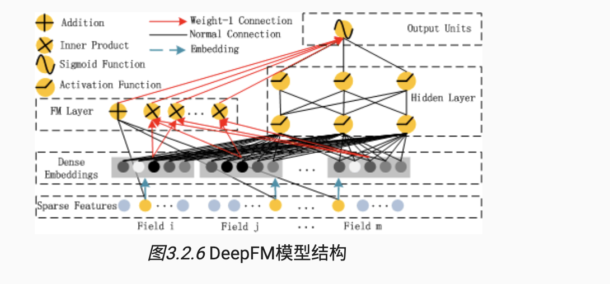

#### DCN（高阶特征交叉、使用残差元素级别(bit-wise) 交叉）
交叉项很重要，它让原始输入 和当前层输入做特征交叉。层数越深，特征交叉的阶数就越高。（残差连接）
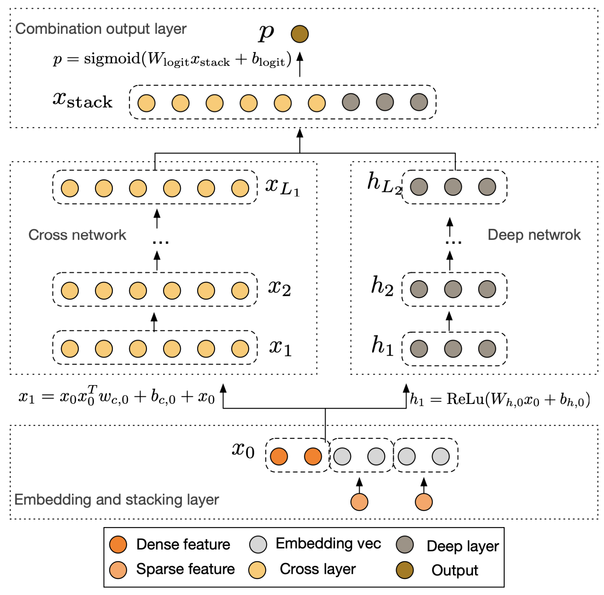

#### xDeepFM（高阶特征交叉、向量级别(vector-wise) 交叉）

DCN虽然能明确地学习高阶特征交叉，但它是在 元素级别(bit-wise) 上做交叉的。也就是说，Embedding向量中的每个元素都单独和其他特征的元素交互，这样就把Embedding向量拆散了，没有把它当作一个完整的特征来看待。为了解决这个问题，xDeepFM提出了压缩交互网络（Compressed Interaction Network, CIN） (Lian et al., 2018) ，改为在 向量级别(vector-wise) 上做特征交互，这样更符合我们的直觉。xDeepFM包含三个部分：线性部分、DNN部分（隐式高阶交叉）和CIN网络（显式高阶交叉），最后把三部分的输出合并得到预测结果
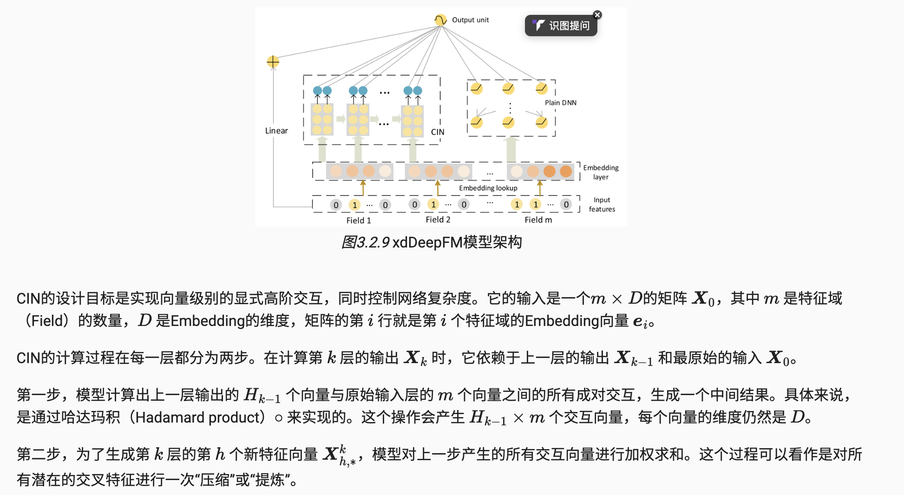
#### Autoint （模型自动学习各种阶数的特征交互）
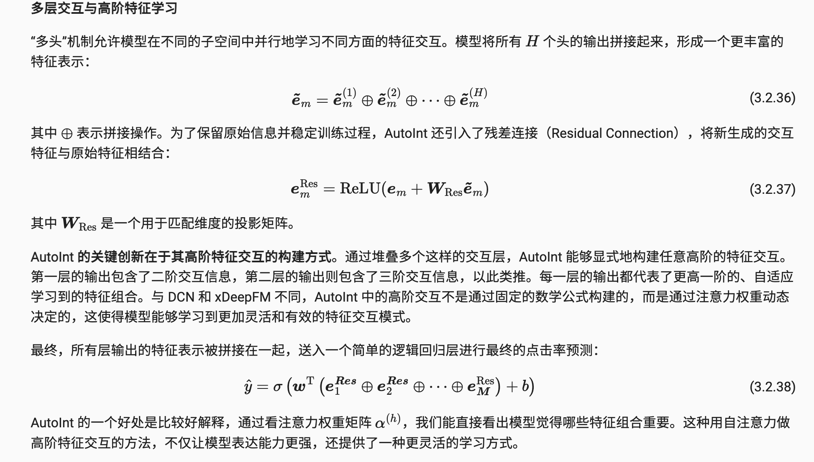
所有层输出的特征表示被拼接在一起，送入一个简单的逻辑回归层进行最终的点击率预测
### 序列建模
从静态特征到动态兴趣序列：特征交叉方法的共同局限是将用户历史行为视为无序集合。序列建模方向认识到用户兴趣具有时序性和动态演化特点。DIN通过注意力机制实现了”目标导向的局部激活”，让用户表示随候选物品而动态变化；DIEN进一步引入GRU建模兴趣随时间的演化过程，并用辅助任务监督中间状态的学习；DSIN则在会话层面捕捉用户在单次购物意图中的行为模式。三者共同揭示了一个洞察：用户对某个候选物品的偏好，并不由其全部历史决定，而是由特定历史片段所激活。

#### DIN
#### DIEN（兴趣演化建模）
DIN成功地捕捉了用户兴趣的”多样性”和”局部激活”特性，但它仍然存在一个局限：它将用户的历史行为看作是一个无序的集合，忽略了行为之间的时序依赖关系。用户的兴趣不仅是多样的，更是在持续演化的。

#### DSIN

### 多目标建模
#### MMOE
Shared-Bottom对相关性低的多个任务出现负迁移的现象，例如电商平台同时优化“点击率”与“客单价”时，低价商品可能会推动点击率的提升，但同时却抑制了客单价的增长；又如内容平台在平衡“内容消费深度”与“广告曝光量”时，深度阅读行为往往与广告点击行为呈负相关。
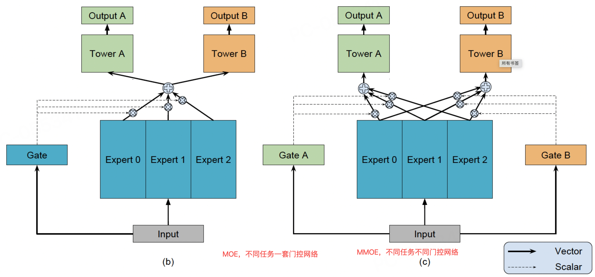
#### PLE 解决软隔离问题
PLE是堆叠CGC单元
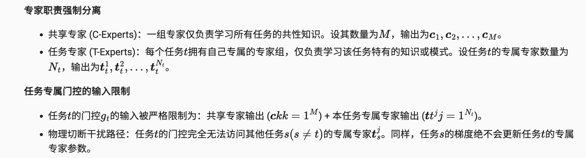
#### 任务依赖建模
##### ESMM
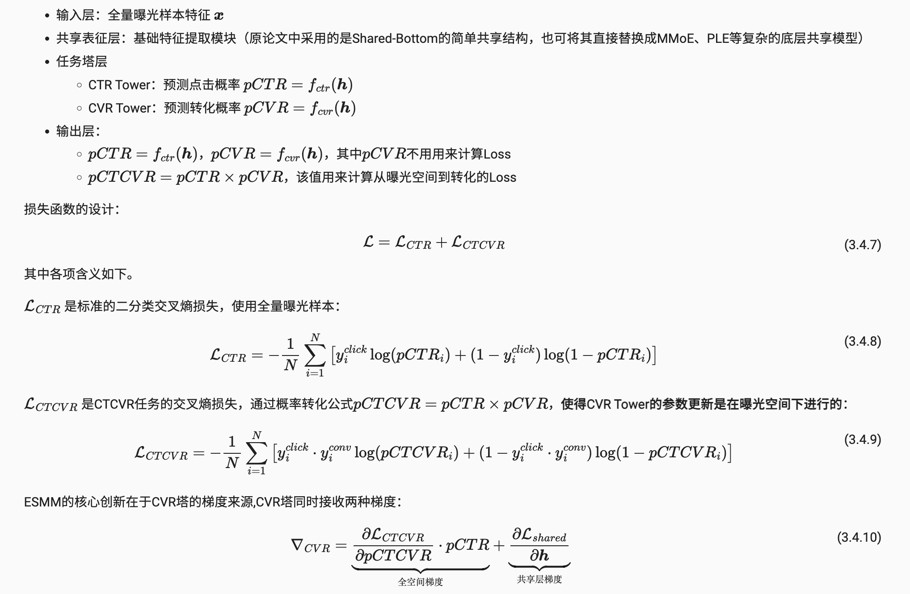
#### 多目标损失
可能存在问题
* 量级失衡问题：不同任务的损失值量级差异显著（如CTR损失通常在0.1-0.5，CVR损失可达2.0+），导致大损失主导优化方向

## 生成式推荐
### 基础
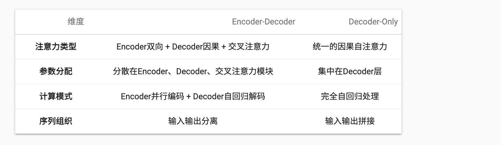
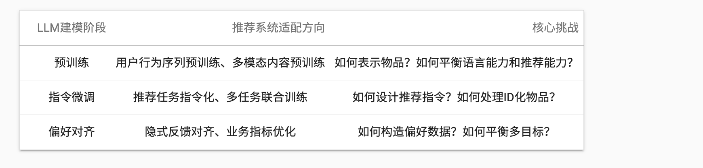
#### Encoder-Decoder架构
* Encoder的双向注意力能够不受因果约束地建模用户的完整行为序列，这对于捕捉用户的长期偏好和全局兴趣模式特别有利。
* 交叉注意力机制提供了一种显式的”查询-检索”模式：在生成每个推荐token时，Decoder可以动态地关注用户历史中最相关的部分，而不是被动地接受一个固定的输入表示。
* 这种架构特别适合输入输出异构的推荐场景。例如，当输入包含用户的多模态特征（行为序列、用户画像、上下文信息）而输出是物品的Semantic ID序列时，Encoder-Decoder的双塔设计能够自然地处理这种异构性。**OneRec**中Encoder被进一步划分为多个pathway（短期pathway、长期pathway、正反馈pathway等），每个pathway专门处理一类行为信号，这种细粒度的结构化设计在Decoder-Only架构中较难实现。
* 典型场景：包括检索式生成（从大规模候选集中生成物品ID序列）和多任务推荐（需要同时建模多种用户行为）
* 交叉注意力的计算开销随着输入序列长度的增加而线性增长，当用户行为序列很长时会成为性能瓶颈
#### Decoder架构
* 最主要的是单向建模的约束：因果注意力只能从左到右处理序列，无法利用”未来”信息。虽然在实际推荐时这是必然的约束（我们不可能提前知道用户未来的行为），但在离线训练阶段，这种单向约束可能会损失一部分建模能力。另一个问题是上下文长度的压力：由于没有独立的Encoder对输入进行压缩，用户的所有历史行为都需要作为上下文输入到Decoder中，当行为序列很长时可能导致计算开销过大。
* Encoder-Decoder可以在离线或异步场景下预先计算Encoder的输出并缓存，减少在线推理时的计算量。但Decoder-Only的统一架构更容易进行端到端的优化（如KV Cache、Speculative Decoding等技术），在实时生成场景下可能反而更高效。HSTU的工业部署经验表明，通过精心的工程优化，Decoder-Only架构可以在毫秒级延迟下完成推荐生成。
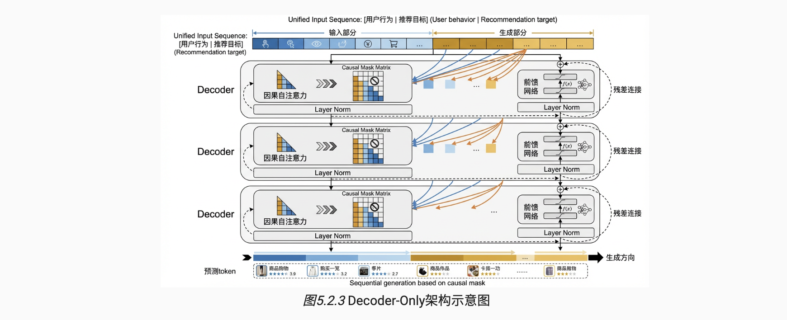
### Tokenizer技术
语义ID范式（Semantic ID-Based）
#### VQ-VAE（Vector Quantised-Variational AutoEncoder）
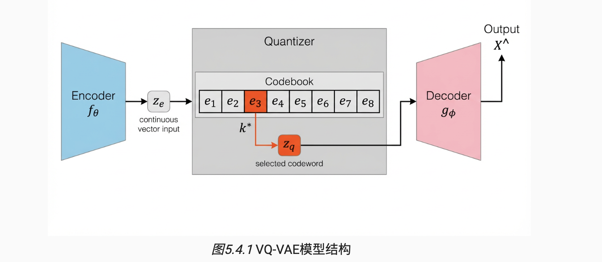
将连续的高维语义表示转换为离散的符号序列
#### RQ-VAE
通过残差量化，在保持码本规模可控（每层仍使用K大小的码本）的同时，将理论表征容量提升至k^L
#### RQ-Kmeans
VQ-VAE和RQ-VAE通过梯度下降学习可训练的码本参数，这要求联合优化编码器、解码器和码本三个组件。RQ-Kmeans [Luo et al., 2024] 提供了一种不同的视角：既然码本的本质是对表示空间的聚类划分，为什么不直接用经典的K-means算法来构建？
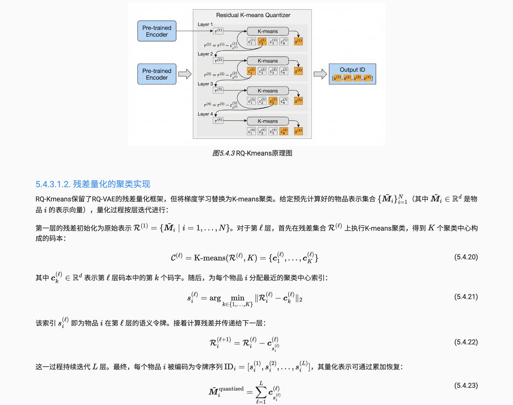
#### RQ-OPQ
* RQ-VAE和RQ-Kmeans通过残差量化构建了层次化的语义ID，但在实际应用中暴露出一个关键问题：最后一层量化后的残差向量被直接丢弃。
* 用RQ方法处理层次化语义，用OPQ（Optimized Product Quantization）处理横向的独特特征。这种设计使得每个物品的语义ID不仅包含从粗到细的层次化令牌序列，还包含编码其独特性的补充令牌。
## 实际local service
 QA (Query Analysis) --> Retrieve (SearchAggregate 召回) --> Merge --> Rank (SearchRank) --> Adjust. 
 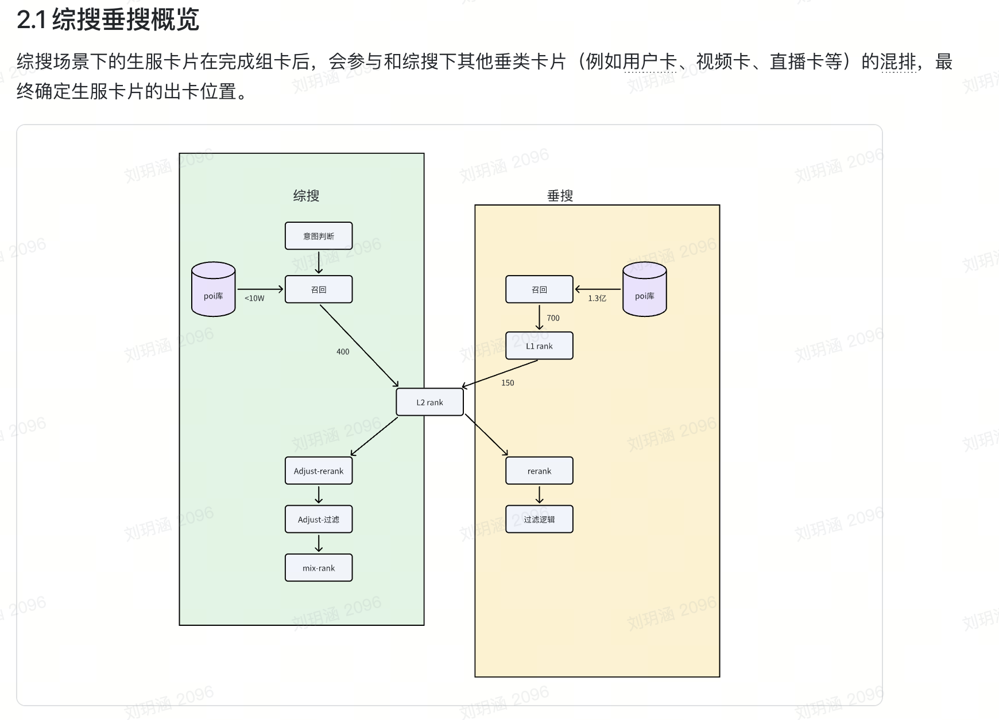
 ### 召回是多路召回
 #### 向量化召回
 一般使用ANN（Approximate nearest neighbor, 近似近邻搜索）
 ### 粗排
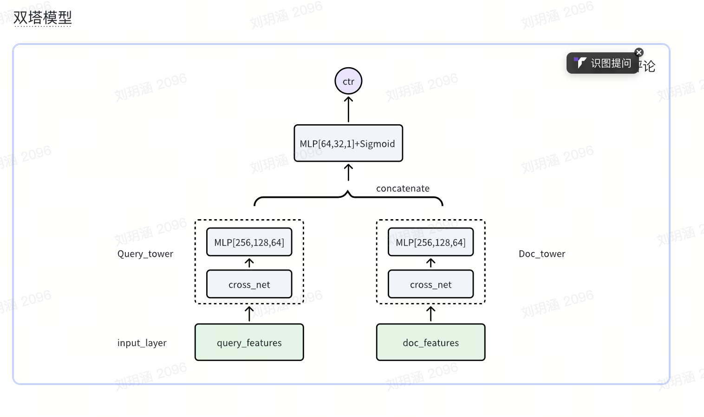
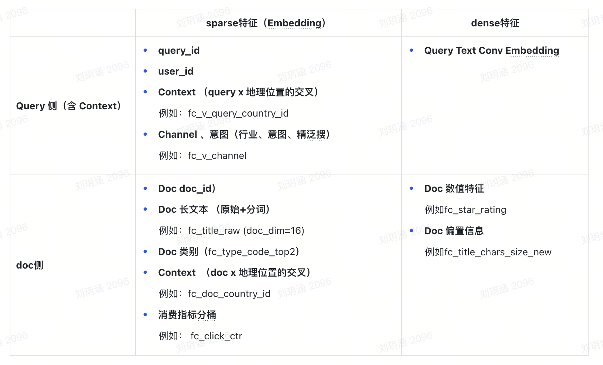
 ### 精排
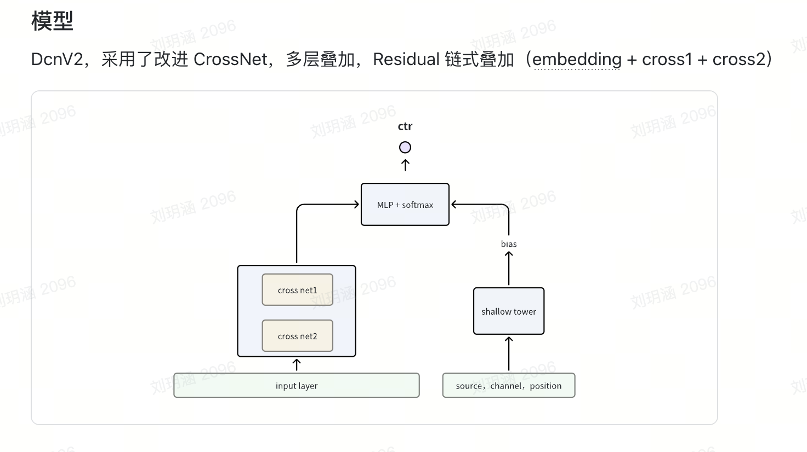

