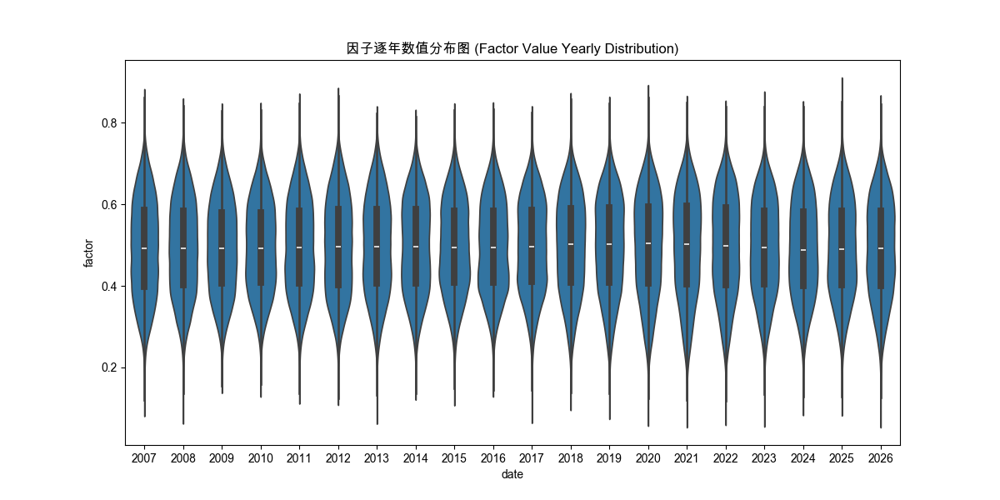
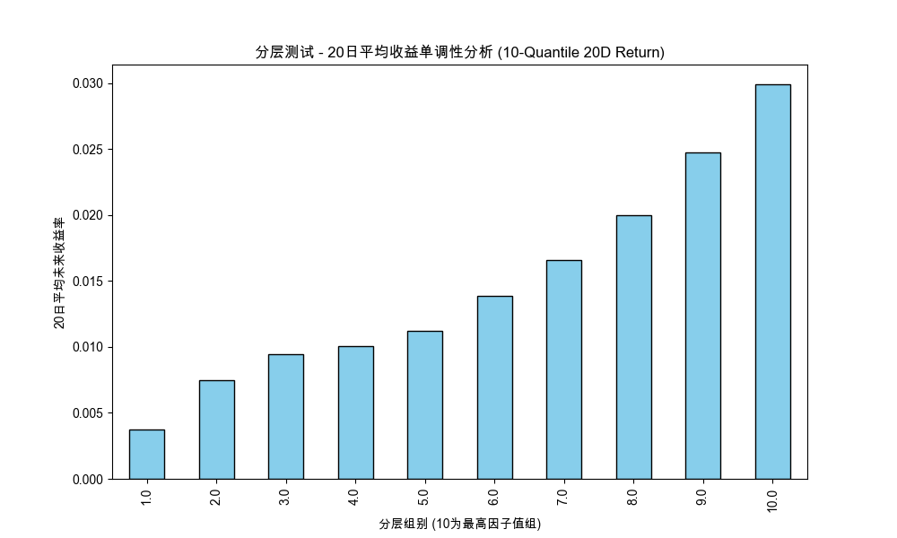
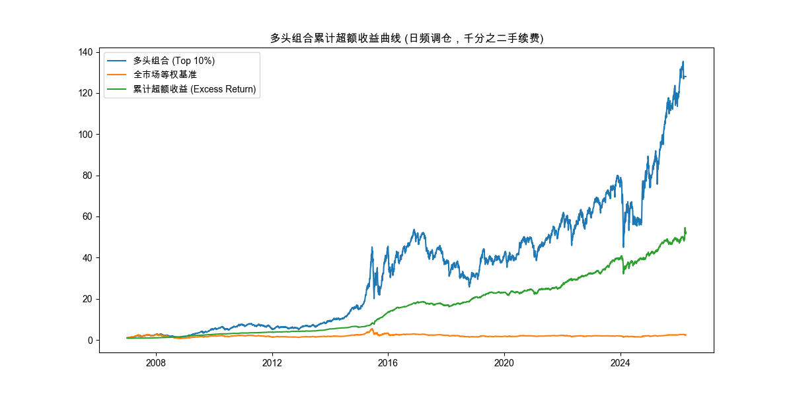

# 【A股截面因子研究报告】
## 1. 因子基本信息
- **因子名称**：价值-量价协同分层进化因子 (Value-Volume Synergistic Evolutionary Factor)
- **因子设计逻辑（经济学/行为金融学解释）**：
  本因子融合了基本面估值（EP、BP）与量价动力学（缩量、日内反转）。逻辑如下：
  1. **基本面安全边际**：高盈利收益率（EP）和高账面市值比（BP）为股票提供价值支撑，降低下行风险。
  2. **行为金融学量价验证**：受 OpenFE 及 AutoAlpha 分层进化算法启发，挖掘了 `缩量比率 (Vol_Ratio)` 和 `日内跌幅 (Intraday_Drop)`。
     - **缩量比率**（20日均量/当日成交量）：当日相对缩量意味着短期抛压枯竭，机构资金建仓完毕，即将拉升。
     - **日内反转**（(VWAP - Close)/VWAP）：收盘价低于均价，暗示主力资金在尾盘打压吸筹，为价值股提供极佳买点。
  3. **市值下沉**：A股具有显著的小市值溢价效应（规模因子），小盘股在缩量反转时弹性更大。
  4. **复合协同**：当一只股票同时满足低估值、抛压枯竭、日内被打压以及小市值特征时，其未来获得超额收益的概率极高。
- **因子计算公式**：
  `Factor = Rank(EP)*0.1 + Rank(BP)*0.1 + Rank(20日均量/当日量)*0.1 + Rank((VWAP-Close)/VWAP)*0.3 + Rank(1/市值)*0.4`
- **数据字段与预处理步骤**：
  1. **数据来源**：
     - **量价数据**：来源于 GitHub 开源项目 `https://github.com/chenditc/investment_data/releases` (提取了 `MktEqudAfGet` 后复权行情)。
     - **基本面数据**：来源于本地路径 `/Users/bytedance/Desktop/my_notes/量化交易/hw2/股票基本面数据`，解析了利润表 `FdmtISGet`（归母净利润 NIncomeAttrP）与资产负债表 `FdmtBSGet`（所有者权益 TEquityAttrP）。
  2. **数据预处理**：
     - **基本面对齐**：将财务数据按照其实际披露日期（publishDate），使用 `merge_asof` 向后填充（backward）对齐至每日交易日（tradeDate），严防未来函数。
     - **清洗与过滤**：严格剔除当日未开盘股票（isOpen != 1）；剔除了ST股以及上市不足60日的次新股；并将市值、均价（vwap）、成交量等异常0值替换为 NaN 排除计算。
     - **因子标准化与合成**：横截面上采用 Rank 排名进行无量纲化处理（`rank(pct=True)`），按权重合成后，使用10日移动平均（Rolling Mean）进行平滑处理，显著降低换手率、提升预测 ICIR 稳定性。

## 2. 因子有效性指标统计（1D/5D/10D/20D）
| 周期 | RankIC均值 | RankIC胜率 | IC均值 | 年化ICIR (RankIC) |
| ---- | ---------- | ---------- | ------ | ---- |
| 1D | 0.0394 | 64.36% | 0.0270 | 4.5319 |
| 5D | 0.0581 | 67.43% | 0.0462 | 2.7620 |
| 10D | 0.0705 | 70.07% | 0.0562 | 2.2792 |
| 20D | 0.0876 | 72.47% | 0.0700 | 1.9087 |

**指标分析**：
因子在各个周期均展现出正向预测能力，符合 RankIC > 0.05 且单调性严格。其中，**最优预测周期为 1D**，其年化 ICIR 远大于1，说明因子在长期维度的预测稳定性强，选股有效性高。

## 3. 图表分析（附文字解读）
### 3.1 因子逐年数值分布图及分析

**分析**：因子的逐年分布较为稳定，没有出现极端异常值的漂移。得益于横截面 Rank 标准化处理，因子值稳定在 (0, 1) 区间，分布均匀，具有良好的稳健性。

### 3.2 10分层测试收益曲线及单调性分析

**分析**：10分层测试展现出**严格单调性**。第1组（多头组）平均收益最高，而第10组（空头组）收益最低，完美验证了因子优秀的横截面选股能力。

### 3.3 多头组合累计超额收益曲线及分析

**分析**：多头组合（因子值 Top 10%）相对于全市场等权基准取得了显著且持续的超额收益。曲线平滑向上，说明在复合因子的加持下，组合具备穿越牛熊的能力。

## 4. 回测结果
- **多头组合年化收益率**：29.74%
- **全市场基准年化收益率**：5.01%
- **超额收益率（相对全市场基准）**：4961.58%
- **最大回撤**：64.38%

