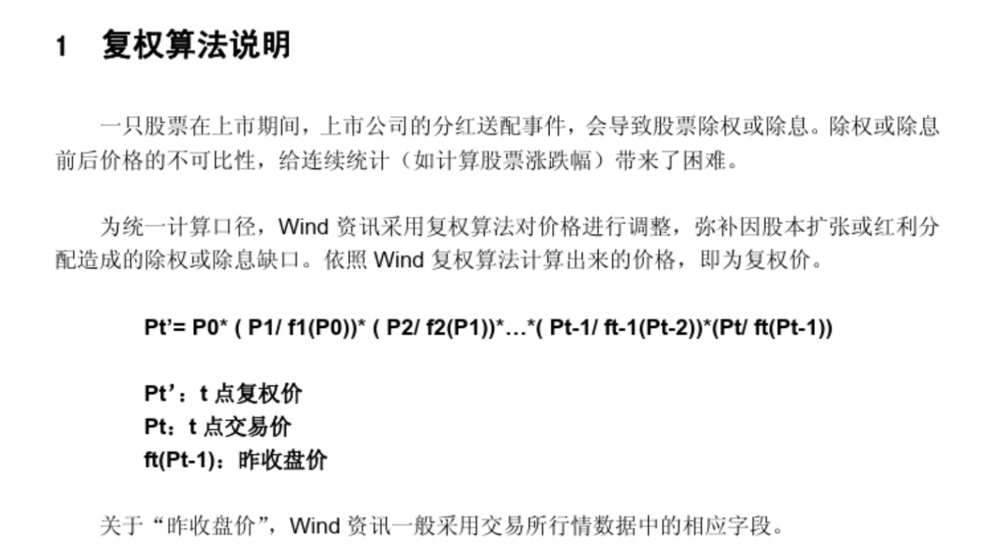
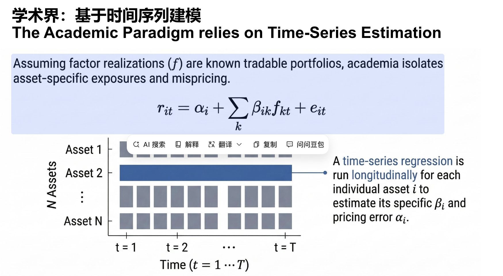
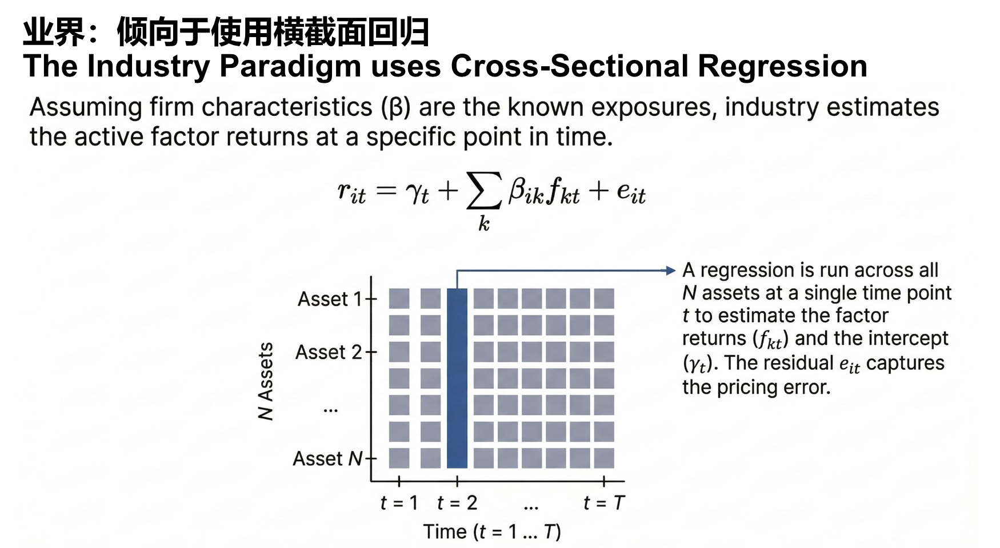
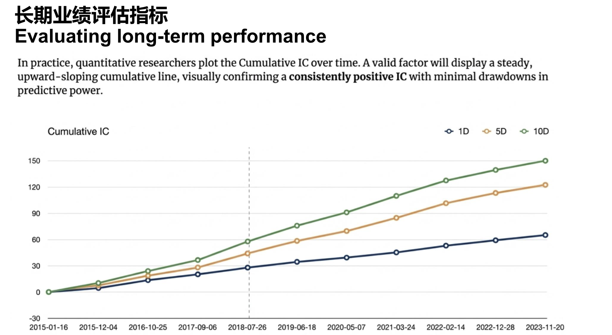

## 复权
* 前复权：当前股价不变，以当前股价为基准向前复权计算股价。 行情软件的行情展示默认是前复权，这样可以保证行情软件看到的最近价格和最近实际价格是一致的。
* 后复权：以上市首日股价作为基准向后复权计算股价。 做历史数据回测一般用后复权。

前复权由于以下2个缺点，使得其不适合用来回测：（1）历史数值是时变的。每次发生派息等除权事件时，历史数值都会根据当前的股价而调整。换句话说，每次发生除权事件后，历史数值都是不一样的。（2）股价可能为负。对于持续分红的公司，其前复权价格可能为负。(3)另外就是前复权是以最新股价为基准修正以前的股价，这样就导致历史数据带有了未来信息

* 复权因子：复权因子就是权息修复比例。

#### 模拟计算：以“未来科技”为例
我们还是用“未来科技”这只股票，但这次严格按照公式来计算。
基础情景：
- Day 0 (上市日):
  - P0 = 10.00元 (上市首日收盘价)
  - 根据公式，基准日的复权价就是其本身，所以 P0' = 10.00元。
- Day 1:
  - 股价正常上涨，收盘于 P1 = 10.50元。
  - 当天没有除权除息，所以 f1(P0) = P0 = 10.00元。
  - 计算Day 1的复权价 P1'：
    - P1' = P0' * (P1 / f1(P0)) = 10.00 * (10.50 / 10.00) = 10.50元。
- Day 2:
  - 股价继续上涨，收盘于 P2 = 11.00元。
  - 当天没有除权除息，所以 f2(P1) = P1 = 10.50元。
  - 计算Day 2的复权价 P2'：
    - P2' = P1' * (P2 / f2(P1)) = 10.50 * (11.00 / 10.50) = 11.00元。
> 小结： 在没有除权除息的情况下，复权价就等于当天的实际收盘价

引入除权除息事件：
- Day 3:
  - 股价上涨，收盘于 P3 = 11.50元。
  - 当天没有除权，P3' = 11.50元。
- Day 4 (除息日):
  - 事件： 公司实施分红，每股派息0.5元。
  - 关键点： 根据交易所规则，Day 4的开盘参考价需要根据Day 3的收盘价进行调整。这个调整后的价格就是公式中的 f4(P3)。
    - f4(P3) = P3 - 0.50 = 11.50 - 0.50 = 11.00元。
  - 假设Day 4当天市场反应平淡，最终收盘价 P4 = 11.00元。
  - 现在，我们计算Day 4的复权价 P4'：
    - P4' = P3' * (P4 / f4(P3))
    - P4' = 11.50 * (11.00 / 11.00)
    - P4' = 11.50元
请注意看！
尽管Day 4的实际收盘价(11.00元)低于Day 3的收盘价(11.50元)，但计算出的复权价P4' (11.50元)与P3' (11.50元)是相等的。
这正是复权的意义所在： 它告诉我们，从Day 3收盘到Day 4收盘，你的总资产并没有因为股价下跌而减少。因为股价虽然“跌”了0.5元，但你的账户里同时多了0.5元的现金红利。复权价通过算法抹平了这个“假跌”，准确反映出你的股票资产价值在这一天实际涨跌幅为0。

## Fama-French 三因子模型拓展 –五因子模型

在量化金融的因子投资体系中，**市值、价值、动量**是最经典的三大基础因子，也是Fama-French系列模型的核心构成，三者分别从**公司规模、估值水平、价格趋势**三个维度刻画股票特征，以下是精准定义、计算逻辑和核心内涵，结合PPT内容做详细说明：

### 一、市值因子（Size Factor）
#### 核心定义
市值因子也叫**规模因子**，通常用**SMB（Small Minus Big，小盘减大盘）** 表示，衡量**小市值股票组合**与**大市值股票组合**之间的收益率差异，核心反映股票的**市值规模效应**。
#### 计算逻辑（Fama-French标准方法）
1. 按股票**总市值**（股价×总股本）对全市场股票排序，均分为两组：S（小盘股，前50%）、B（大盘股，后50%）；
2. 计算两组股票的**市值加权月收益率**；
3. $SMB_t = 小盘组合收益率_t - 大盘组合收益率_t$（Fama-French三因子中为6个交叉组合的小盘均值减大盘均值，更精准）。
#### 核心内涵
经典市场规律为**小盘股效应**：长期来看小市值股票的收益率高于大市值股票（美股1926-2000年显著），原因是小盘股存在更高的流动性风险、经营风险，需要风险溢价补偿；但在市场成熟度提升、资金抱团大盘股的阶段，该效应可能失效。
#### 简单例子
某月小盘股组合（如中证1000成分股）涨8%，大盘股组合（如沪深300成分股）涨4%，则当月市值因子SMB=4%，代表市值因子为正，小盘股跑赢大盘股。

### 二、价值因子（Value Factor）
#### 核心定义
价值因子通常用**HML（High Minus Low，高账面市值比减低账面市值比）** 表示，衡量**高价值股票组合**与**低价值股票组合**的收益率差异，核心反映股票的**估值溢价/折价效应**，判断股票是否被低估/高估。
#### 核心计算指标与逻辑
1. 核心指标：**账面市值比（B/M）** = 股东权益账面价值 / 股票市场总价值，B/M越高，代表股票的估值越低，越属于**价值股**；B/M越低，估值越高，越属于**成长股**；
2. Fama-French标准方法：
   - 按B/M将股票分为三组：H（高价值，前30%）、M（中等，中间40%）、L（低价值，后30%）；
   - 与市值因子的S/B组交叉得到6个组合，计算各组合市值加权收益率；
   - $HML_t = (高B/M组合均值)_t - (低B/M组合均值)_t$。
#### 核心内涵
经典规律为**价值股效应**：长期来看低估值的价值股收益率高于高估值的成长股（美股传统市场显著），原因是价值股往往是市场关注度低、基本面被低估的标的，存在估值修复的空间；但在科技/创新驱动的市场阶段，成长股（低B/M）可能因业绩高增长跑赢价值股，导致HML为负。
#### 分类与例子
PPT中按B/M划分价值股/成长股：
- 价值股：B/M>0.7（如银行、地产、传统制造股，估值低、业绩稳定）；
- 成长股：B/M<0.3（如人工智能、半导体、新能源股，估值高、业绩高增长预期）；
- 某月高B/M的银行股组合涨7%，低B/M的半导体股组合涨3%，则当月HML=4%，价值因子为正。

### 三、动量因子（Momentum Factor）
#### 核心定义
动量因子通常用**UMD（Up Minus Down，赢家减输家）** 表示（Carhart四因子模型），衡量**过去收益高的股票（赢家）** 与**过去收益低的股票（输家）** 的未来收益率差异，核心反映股票价格的**趋势延续效应**，即“强者恒强，弱者恒弱”。
#### 计算逻辑（经典方法）
1. 按股票**过去12个月（剔除最近1个月，避免短期反转）** 的累计收益率排序，均分为三组：U（赢家，前1/3）、M（中间，1/3）、D（输家，后1/3）；
2. 计算赢家组合和输家组合的市值加权收益率；
3. $UMD_t = 赢家组合收益率_t - 输家组合收益率_t$。
#### 核心内涵
核心基于**动量效应**（Jegadeesh&Titman，1993）：股票的价格趋势会在一定周期内延续，过去涨得多的股票，未来短期内仍大概率上涨；过去跌得多的股票，未来短期内仍大概率下跌。
原因是市场投资者存在**追涨杀跌的行为偏差**，以及信息传递的滞后性，导致价格趋势不会立即反转，动量因子正是捕捉这一市场非有效性的收益。
#### 简单例子
某股票过去11个月累计涨60%（赢家），另一股票过去11个月累计跌30%（输家），若下月赢家涨5%、输家跌2%，则当月UMD=7%，动量因子为正，动量策略有效。

### 三大因子核心对比表
| 因子类型 | 核心指标/符号 | 衡量维度 | 核心规律 | 收益来源 |
|----------|---------------|----------|----------|----------|
| 市值因子 | SMB（小盘-大盘） | 公司规模 | 小盘股效应（小盘跑赢大盘） | 流动性/经营风险溢价 |
| 价值因子 | HML（高B/M-低B/M） | 估值水平 | 价值股效应（低估值跑赢高估值） | 估值修复+基本面回归 |
| 动量因子 | UMD（赢家-输家） | 价格趋势 | 动量效应（强者恒强，弱者恒弱） | 投资者行为偏差+信息滞后 |

### RMW = 盈利稳健股 - 盈利薄弱股

* 将股票分成6组（按size分组是减少size影响，类似和size正交的操作）
例如现实中常见情况：
小公司盈利率高但风险高，大公司盈利稳定但盈利率低。那么：Robust 组可能 小盘股很多，Weak 组可能 大盘股很多
SW等计算用市值加权收益率，不是简单等权
* SW等计算用市值加权收益率，不是简单等权

1. 将股票分成6组（按size分组是减少size影响，类似和size正交的操作）
核心含义
构建盈利因子（RMW=盈利稳健股-盈利薄弱股）时，并非直接把全市场股票按盈利水平分成3组，而是**先按市值（size）分成S（小盘）、B（大盘）2组，再在每个市值组内，按盈利水平分成W（薄弱）、N（中性）、R（稳健）3组**，最终交叉得到**SW、SN、SR、BW、BN、BR**6个组合；
这样做的核心目的是**降低市值因子对盈利因子的干扰**，让盈利因子的收益仅反映“盈利水平”的差异，而非市值规模的差异，这一操作的效果和**因子正交化**一致（让盈利因子与市值因子统计上不相关）。

关键逻辑
如果不按市值分组，直接按盈利水平选股，会出现**盈利稳健的股票大概率是小盘股、盈利薄弱的股票大概率是大盘股**的情况，此时构建的盈利因子会混杂**市值因子的收益**，无法判断因子收益是来自“盈利水平”还是“市值规模”；按市值分组后，在**小盘股内部**比较盈利稳健和薄弱的差异，在**大盘股内部**做同样比较，再合并计算，就能剔除市值的影响。

类比理解
想比较“不同班级学生的学习成绩”，但发现实验班学生普遍是高年级、普通班是低年级，直接比成绩会混杂“年级”的影响；因此先按年级分组，再在每个年级内比较实验班和普通班的成绩，结果才更纯粹。

2. 例如现实中常见情况：小公司盈利率高但风险高，大公司盈利稳定但盈利率低
这是对**按市值分组的现实依据**的解释，也是为什么不分组会导致盈利因子混杂市值影响的核心原因，是资本市场的普遍规律：
- **小盘股**：中小企业往往处于成长期，业务扩张快，单季度/年度的盈利**率**（如ROE、销售净利率）容易冲高，但公司抗风险能力弱、业绩波动大，盈利**稳定性**差；
- **大盘股**：龙头企业处于成熟期，业务布局稳定，盈利**稳定性**高（不会大起大落），但受行业天花板、规模效应限制，盈利**率**很难持续走高，整体盈利率偏低。

正是这一现实规律，导致**全市场盈利水平排名靠前的股票，小盘股占比会极高；盈利水平靠后的股票，大盘股占比会极高**，因此必须按市值分组，才能剥离市值干扰。

3. 那么：Robust 组可能 小盘股很多，Weak 组可能 大盘股很多
这是对上述现实规律的直接推论，进一步印证了**按市值分组的必要性**：
- **Robust组（盈利稳健组）**：如果不按市值分组，直接筛选全市场盈利最稳健/盈利水平最高的股票，结果会是**小盘股占绝大多数**（因为小盘股盈利率普遍更高）；
- **Weak组（盈利薄弱组）**：同理，直接筛选全市场盈利最薄弱的股票，结果会是**大盘股占绝大多数**（因为大盘股盈利率普遍偏低）。

此时若直接用“Robust组-Weak组”计算盈利因子收益，得到的实际是**“小盘股组合-大盘股组合”的收益**（市值因子SMB的收益），而非真正的盈利因子收益，失去了因子构建的意义。

4. SW等计算用市值加权收益率，不是简单等权
这是盈利因子计算中**组合收益率的具体规则**，和Fama-French三因子的计算逻辑一致，核心是为了**贴合实际投资场景，避免小市值股票对组合收益的过度干扰**：
- **SW**：即“小盘股+盈利薄弱股”组合，同理SN（小盘+中性）、SR（小盘+稳健）、BW（大盘+薄弱）等都是6个交叉组合的简称；
- **市值加权收益率**：按组合内每只股票的**自由流通市值**占组合总市值的比例，计算加权平均收益率，市值越大的股票，对组合收益的贡献越高；
- **非简单等权**：如果用简单等权（每只股票权重相同），组合收益会被市值极小的股票主导（比如小盘股组合中，一只微盘股涨100%会大幅拉高组合收益），结果脱离实际投资（普通投资者/机构无法对微盘股重仓配置），市值加权更符合真实的投资操作。

## 学术界vs业界
### 学界

#### 拆解核心操作（以CAPM单因子模型为例，最易理解）
这句话的操作落地分为3步，核心是**用单只股票的历史收益，对市场的历史收益做时间维度的回归**，过程完全贴合CAPM的计算逻辑：
1. **确定研究标的**：选定**单只资产i**（比如贵州茅台、苹果公司，即每一只股票单独分析，不混合其他股票）；
2. **收集时间序列数据**：获取该资产i和市场组合（如沪深300、标普500）**连续的历史收益数据**（常用月收益/周收益，时间维度越长，结果越稳健，比如5年的月收益共60个数据点）；
   - 资产i的时间序列收益：$r_{i,1},r_{i,2},...,r_{i,T}$（T为时间节点数，如T=60）；
   - 市场组合的时间序列收益：$r_{m,1},r_{m,2},...,r_{m,T}$；
3. **做时序回归计算**：将资产i的收益作为**因变量**，市场组合的收益作为**自变量**，代入线性回归公式（CAPM核心公式）：
   $$r_{i,t}-r_f = \alpha_i + \beta_i(r_{m,t}-r_f) + \epsilon_{i,t}$$
   通过回归算法拟合出**这只股票独有的βᵢ**（对市场因子的暴露/敏感度）和**αᵢ**（定价误差/超额收益），残差$\epsilon_{i,t}$为随机波动。

#### 关键特点（为什么是学术界的核心方法）
1. **个股单独回归**：每只股票算一次βᵢ和αᵢ，结果是**个股专属**的，能精准衡量单只资产对因子的敏感度（比如A股中证券股的βᵢ≈1.5，公用事业股的βᵢ≈0.8，就是各自时序回归的结果）；
2. **时间轴为核心**：所有数据都是**同一标的在不同时间的连续数据**，而非某一时间点的全市场横截面数据（这是和工业界横截面回归最核心的区别）；
3. **服务于归因解释**：学术界通过这种方式，能清晰**解释单只资产的历史收益来源**——多少来自因子的风险溢价（βᵢ×因子收益），多少来自模型未捕捉的定价误差（αᵢ），契合学术界“追求模型可解释性、统计显著性”的目标。

#### 举个通俗例子
以**贵州茅台（资产i）**和**沪深300（市场m）**为例，取2020-2024年共60个月的月收益数据，做时序回归：
- 回归后得到**茅台专属的βᵢ=0.7**：代表沪深300涨1%，茅台平均涨0.7%，对市场波动的敏感度较低（消费白马股的典型特征）；
- 同时得到**αᵢ=0.5%**：代表茅台每月有0.5%的收益，无法被沪深300的波动解释，这是茅台超越市场的**超额收益（定价误差）**；
这个过程，就是这句话描述的“对单只资产i做纵向的时间序列回归，估算βᵢ和αᵢ”。

#### 延伸：这句话的适用范围
不仅是CAPM单因子模型，**Fama-French三因子/五因子模型**也遵循这一逻辑：只是把自变量从“单一市场收益”，换成**市场、市值、价值、盈利、投资**多个因子的时间序列收益，依旧是**对每只股票单独做时间序列回归**，拟合出个股对每个因子的专属βᵢ（如市值因子β、价值因子β），以及整体的αᵢ。
### 业界

#### 一、核心字面+专业含义翻译
**在单一时间点t，对全市场所有N只资产开展横截面回归分析，以此估算该时间点的因子收益率$f_{kt}$和截距项$\gamma_t$，而回归得到的残差$e_{it}$则代表单只资产在该时间点的定价误差。**
- **across all N assets**：横向覆盖全市场所有资产（个股/债券等），是**横截面维度**的分析（而非学术界的时间维度）；
- **a single time point t**：固定某一个时间节点，比如2025年4月6日、2025年3月31日（工业界常用**日/月**为时间单位，Barra模型多为日频）；
- **factor returns $f_{kt}$**：因子收益率，即某一因子在时间t的收益（是工业界横截面回归的**核心求解目标**，和学术界先定因子收益再算暴露相反）；
- **intercept $\gamma_t$**：截距项，代表全市场所有资产的**平均无风险收益/基准收益**，是时间t的市场整体基准；
- **residual $e_{it}$**：回归残差，即单只资产i的实际收益无法被因子模型解释的部分，也就是**该资产在时间t的定价误差**（被高估/低估的部分）。

#### 二、横截面回归的核心前提（工业界默认规则）
工业界做该回归的核心前提是：**单只资产的因子暴露$\beta_{ik}$是**已知的、可直接计算的**（这是和学术界的关键差异）**。
因子暴露无需通过回归拟合，而是根据资产的客观属性直接赋值，比如：
- 行业因子：银行股对“银行因子”的暴露$\beta=1$，对其他行业因子暴露$\beta=0$；
- 市值因子：根据股票总市值标准化后，直接得到每只股票的市值因子暴露值；
- 风格因子（如动量/价值）：根据量价/财务数据计算后，直接赋值每只股票的因子暴露。

#### 三、核心公式+操作落地（通俗版）
工业界横截面回归的核心公式在PPT中为：$r_{it}=\gamma_{t}+\sum_{k} \beta_{ik} f_{kt}+e_{it}$
以**2025年4月6日（时间t）、A股全市场5000只股票（N=5000）、3个因子（市场/市值/价值，k=3）**为例，操作仅需2步：
1. **整理已知数据**：
   - 因变量$r_{it}$：5000只股票在4月6日的**实际收益率**（涨跌幅）；
   - 自变量$\beta_{ik}$：5000只股票对市场、市值、价值3个因子的**已知暴露值**（形成5000×3的暴露矩阵）；
2. **做横截面回归求解**：
   将上述数据代入回归公式，拟合计算出**未知的3个因子在4月6日的收益率$f_{kt}$**（如市场因子收益0.8%、市值因子收益0.3%、价值因子收益-0.2%），以及**当日市场截距项$\gamma_t$**（如0.05%）；
   同时得到每只股票的残差$e_{it}$（即定价误差）。

#### 四、关键指标的实际含义（结合例子）
以单只股票**贵州茅台（资产i）**在2025年4月6日的数据为例：
- 若茅台实际收益率$r_{it}=0.5\%$，通过因子暴露和求解出的因子收益计算的**模型预测收益率**=0.05%（$\gamma_t$）+0.7（市场暴露）×0.8%+0.2（市值暴露）×0.3%+0.6（价值暴露）×(-0.2%)=**0.47%**；
- 则茅台的定价误差$e_{it}$=实际收益-模型预测收益=0.5%-0.47%=**0.03%**；
  ✅ 残差$e_{it}>0$：代表该资产**被市场低估**（实际收益高于模型预测，存在正向定价误差）；
  ✅ 残差$e_{it}<0$：代表该资产**被市场高估**（实际收益低于模型预测，存在负向定价误差）；
  ✅ 残差$e_{it}=0$：代表资产定价完全符合因子模型，无定价误差。

#### 五、该方法的核心价值（工业界为什么用）
1. **贴合实操需求**：工业界核心目标是**实时计算因子收益率、做风险归因和组合优化**，横截面回归能在每个时间点快速算出当日所有因子的收益，直接指导当日的投资决策；
2. **适配已知暴露的特点**：行业、市值等因子的暴露可直接计算，无需像学术界那样通过长期时序回归拟合，效率更高，适合日频/高频的量化交易；
3. **精准捕捉市场定价偏差**：残差$e_{it}$能实时反映单只资产的定价误差，工业界可基于此挖掘Alpha机会（比如买入被低估的股票、卖出被高估的股票）。

#### 六、和学术界时序回归的核心对比（一句话总结）
- 学术界：**固定单只资产，沿时间轴回归**，**已知因子收益，求解资产的因子暴露+α**（解释历史收益）；
- 工业界：**固定单个时间点，沿全市场资产回归**，**已知资产的因子暴露，求解因子收益+定价误差**（指导当下决策）。

## 评价
RankIC → IC → 累计 IC → ICIR
IC（信息系数）
ICLR（信息比率）

